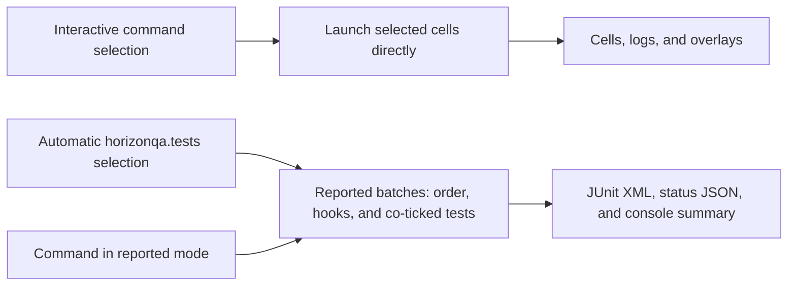

# Execution model

Horizon-QA has one test-instance model and two orchestration paths. Understanding the difference prevents local runs from accidentally exercising a different lifecycle than CI.

## Interactive and reported execution

| Path | Best for | Orchestration | Output |
|---|---|---|---|
| Interactive commands | Local authoring and visual inspection | Launch the selected tests directly | Cells, logs, and client overlays |
| Automatic execution | CI or unattended server runs | Select, group, and run reported batches after startup | JUnit XML, status JSON, console summary, optional process exit |
| Manually reported commands | Local or controlled reported runs | Use the batch runner without startup autorun | The same reports, while the server normally remains available |

The `interactive`, `ci`, and `off` mode values are presets:

| Mode | Default behavior |
|---|---|
| `interactive` | Discovery and commands enabled, normal world policy, no startup autorun |
| `ci` | Discovery, startup autorun, void world policy, reports, and process exit |
| `off` | Commands, discovery, runners, and test visuals inactive |

Properties such as `horizonqa.autoRun`, `horizonqa.stopServer`, `horizonqa.world`, and `horizonqa.gridOrigin` override individual preset choices. See [JVM properties](../reference/jvm-flags.md).

The selection source chooses the orchestration path. Interactive commands launch cells directly, while automatic and manually reported runs converge on the same batch runner and report formats.

*Interactive and reported execution share test instances, but only the reported path applies batch ordering and hooks.*

## Batches and concurrency

The `batch` attribute applies only to automatic and manually reported execution.

The batch runner:

1. Groups selected tests by batch name.
2. Executes batch names one after another.
3. Runs every matching `@BeforeBatch` hook.
4. Prepares the tests in that batch.
5. Starts those test instances together and ticks them concurrently.
6. Runs every matching `@AfterBatch` hook after all tests finish.

A failed before-hook blocks the tests in that batch. A failed after-hook becomes an infrastructure issue after the tests have run.

Batch names are global across all discovered holders. Prefer a mod-prefixed value such as `mymod_assembler` when collisions are possible.

!!! important "Interactive commands bypass batch lifecycle"

    Normal interactive `/horizonqa run`, `runall`, and `runfailed` commands launch their selected tests directly. They do not group or order tests by `batch`, and they do not invoke batch hooks.

Use `-Dhorizonqa.mode=ci -Dhorizonqa.autoRun=false` and a command-started reported run when you need to reproduce batch ordering and hooks locally.

## Shared state during concurrent tests

Tests in one reported batch tick concurrently on the same server thread. Different cells separate their fixtures in space, but they do not separate world-wide or process-wide state.

The rules for shared mutations, batch separation, and cleanup are detailed in [Fixtures, coordinates, and isolation](fixtures-and-isolation.md#spatial-separation-and-global-state).

## Normal test ticks

A normal test tick has two framework phases around Minecraft world logic:

1. START callbacks and START sequence actions run.
2. Minecraft world logic runs.
3. END callbacks, polling, END sequence actions, and timeout checks run.

`GameTestSequence` methods default to END so assertions normally observe the world after it has ticked. START variants are useful when an input must be visible to a machine during that same world tick.

The test body itself runs before the first counted tick. Timeout is evaluated after the END phase of the final allowed tick, so END actions scheduled at `timeoutTicks` still run before timeout is reported.

See [Sequences and timing](../guide/sequences.md) for scheduling, bounded waits, and phase-ordering rules.

## GregTech time-warp

GregTech time-warp is a synchronous inner loop inside a test method. It force-ticks `IGregTechTileEntity` instances in a bounded region without waiting for normal 20 TPS progression.

Time-warp:

- processes registered virtual EU jobs,
- ticks matching GregTech tile entities in deterministic position order,
- optionally compares watched controller state after each simulated tick,
- advances the event recorder's logical clock.

It does not:

- advance global server time,
- tick normal entities or vanilla tile entities,
- advance the outer `GameTestSequence` scheduler,
- simulate cables, packet loss, or every Minecraft subsystem.

The sequence scheduler and time-warp therefore use different loops. A long warp can advance event timestamps by hundreds of logical ticks while the outer test remains on the same server tick.

Use [GTNH multiblock API](../guide/gtnh-api.md) for `runRecipe`, `runUntilMachineIdle`, watched controllers, virtual EU supply, and warp-range limits.

## Choosing the path

| Goal | Use |
|---|---|
| Iterate on one failing fixture with overlays | Interactive `run` or `runthis` |
| Inspect a whole namespace visually | Interactive `runall <namespace>` |
| Verify batch hooks or batch ordering locally | Manually reported execution |
| Produce CI artifacts and a stable exit code | Automatic `ci` execution |
