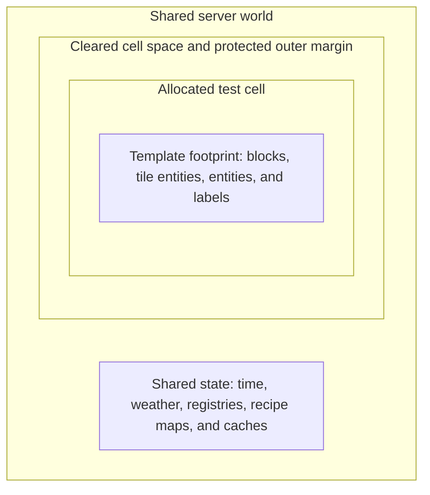

# Fixtures, coordinates, and isolation

Horizon-QA controls enough setup to make tests repeatable, while leaving Minecraft and GregTech responsible for the behavior under test.

## Real validation, controlled setup

The framework keeps validation real:

- GregTech decides whether a multiblock forms.
- Recipe maps decide whether inputs match.
- Machine logic decides whether processing starts or stops.
- Real inventories and fluid handlers route outputs.
- Real blocks and tile entities provide world behavior.

Some setup operations are deliberately controlled:

- Structure templates place a known fixture.
- Virtual EU supply adds `voltage × amperage` directly to an energy buffer during simulated ticks.
- Time-warp directly ticks GregTech tile entities in a bounded region.
- Synthetic recipes temporarily add a recipe to a real recipe map.

These controls make a state reachable without replacing the validation that the test exists to exercise. The guiding rule is: **control supply, never replace validation**.

## Structure fixtures and grid cells

A structure-backed test loads its template from the mod classpath. Horizon-QA rotates the fixture, restores tile and entity data, and resolves labels before the test body starts.

Each test receives a grid cell with clearance around it. Before placement, Horizon-QA clears the cell and its margin and forces the required chunks. Empty-template tests receive a cleared default-size cell without structure placement.

Grid cells keep fixtures from occupying the same physical space. They are not separate dimensions, worlds, registries, or server processes.

The spatial boundary is nested inside a world whose process-wide state remains shared:

*Cells prevent fixtures from overlapping in space; they do not isolate world-wide or process-wide state.*

See [Structure templates](../guide/structures.md) for export, file formats, labels, rotation, and placement.

## Interactive template loading

Reported execution treats a missing or unreadable template as a `TEMPLATE_ERROR` and does not start that test.

The current interactive runner logs the load failure and continues with an empty cell. If an interactive fixture appears absent, check the server log before debugging assertions. Use reported execution when the template-load failure itself needs deterministic classification.

## Coordinate spaces

Most Horizon-QA APIs use **test-local** coordinates. The framework adds the test origin when it accesses the world.

| Expression | Coordinate space | Use it for |
|---|---|---|
| `helper.pos("controller")` | Test-local, with template rotation applied | Preferred access to a named fixture position |
| `TestPos.at(x, y, z)` | Raw test-local | Temporary positions or inline fixtures |
| `helper.absolute(x, y, z)` | World-absolute | Direct Minecraft or mod APIs that require world coordinates |
| `helper.absolute("controller")` | World-absolute, with label rotation applied | Direct world APIs and diagnostics |

!!! warning "Convert exactly once"

    Methods such as `assertBlockPresent`, `insertItem`, and the GTNH facade expect test-local positions. Passing `helper.absolute(...)` back into one of those methods adds the origin twice.

Named labels are safer than repeated raw coordinates. The exported template stores the meaning of the position, and label resolution applies the test's configured rotation.

## Spatial separation and global state

Cells isolate space, not global behavior. Tests still share:

- world time and weather,
- gamerules,
- registries and static caches,
- recipe maps,
- mod-level singletons,
- server-wide player or network state.

Synthetic recipes demonstrate this boundary. `withTestRecipe(...)` registers cleanup so the recipe lifetime is scoped to the test, but the underlying recipe map is global. Another concurrently running test can see that recipe before cleanup.

In reported execution, place tests that mutate the same global surface in different batches. In interactive mode, launch them separately. Use unique fixture inputs when shared visibility cannot be avoided.

## Cleanup ownership

Framework-owned helpers register cleanup for the resources they create. For example, temporary recipe injection registers recipe removal through `afterTest`.

Your test still owns manual mutations outside those helpers. Register `helper.afterTest(...)` for registry changes, global flags, external caches, or other resources that must be restored on pass, failure, timeout, and error.

World-control helpers such as fixed time and weather also restore the original state through cleanup. Cleanup failures become infrastructure errors because leaving shared state behind can invalidate later tests.

## The built-in isolation scan

The cell scanner runs during cleanup and is intentionally narrow:

- It warns about non-air blocks inside the cell but outside a placed template's footprint.
- It fails when a GregTech tile entity reaches the protected outer cell margin.

It does not inspect:

- loose entities,
- fake players,
- fluid state,
- world rules,
- global registries,
- arbitrary mod caches.

Treat the scanner as a guardrail, not proof of complete isolation. Explicit cleanup remains necessary for every resource outside its checks.

## Controlled GTNH operations

Two common helpers deliberately stop at the supply boundary:

- Virtual EU supply writes directly to an energy buffer. It does not validate packet voltage, cable loss, or hatch-tier rejection.
- Time-warp ticks only `IGregTechTileEntity` instances in its region. It does not advance global time or every object in the world.

Synthetic recipes are real entries in a global recipe map, not a private mock map. These limitations are intentional and should shape what each test claims to validate.

See [GTNH multiblock API](../guide/gtnh-api.md) for the exact helper contracts and [Design principles](../contributing/principles.md) for the testing philosophy behind them.
