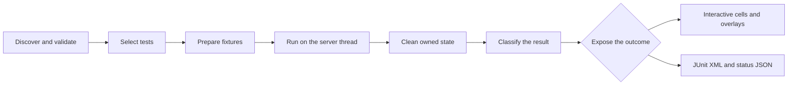

# Learn Horizon-QA

Horizon-QA turns a Forge development server into an end-to-end test environment. Test code stays in the mod being tested. The framework discovers that code, prepares a world fixture, runs the test on the server thread, cleans up, and exposes the result for local inspection or CI.

## The mental model

-   :material-magnify:{ .lg .middle } **Discover**

    ---

    Find and validate annotated test methods.

-   :material-filter-variant:{ .lg .middle } **Select**

    ---

    Choose tests through commands or CI selectors.

-   :material-cube-outline:{ .lg .middle } **Prepare**

    ---

    Allocate a cell and place its fixture.

-   :material-play-circle-outline:{ .lg .middle } **Run**

    ---

    Execute the test body, callbacks, and sequences.

-   :material-broom:{ .lg .middle } **Clean**

    ---

    Run registered cleanup on every outcome.

-   :material-file-chart-outline:{ .lg .middle } **Report**

    ---

    Keep visual evidence or write CI reports.

The same lifecycle serves local investigation and automated reporting; the path only branches when Horizon-QA exposes the outcome.

*The execution path is shared through cleanup and classification, whether the result is inspected in-game or consumed by CI.*

Three boundaries explain most framework behavior:

- **Lifecycle:** every test moves through discovery, preparation, execution, cleanup, and a final result.
- **Execution:** normal interactive commands launch tests directly, while automatic and manually reported runs use ordered batches.
- **Fixture boundary:** cells provide spatial separation, but world rules, registries, recipe maps, and other global state remain shared.

## Read in order

[Runtime lifecycle](runtime-lifecycle.md)
: Follow a test from Forge discovery through cleanup, failure classification, and reporting.

[Execution model](execution-model.md)
: Understand interactive and reported execution, batches, concurrency, server tick phases, and GregTech time-warp.

[Fixtures, coordinates, and isolation](fixtures-and-isolation.md)
: See what the framework controls, what remains real, how coordinate spaces work, and where isolation stops.

## Keep these rules in mind

1. Most helper methods expect **test-local** coordinates. Convert to world coordinates only for APIs that explicitly need them.
2. Controlled setup may supply a state, but GregTech and Minecraft still perform the behavior being validated.
3. Cleanup is part of the test contract because grid cells cannot isolate global state.
4. The event trace explains history; final-state assertions explain the outcome. Useful tests usually need both.

## Failure and cleanup

Cleanup timing belongs to the [runtime lifecycle](runtime-lifecycle.md#5-complete-and-clean). The resources and states that require cleanup depend on the framework's [isolation boundaries](fixtures-and-isolation.md#cleanup-ownership).

## Choose your next step

- New to Horizon-QA: [Getting started](../getting-started/index.md).
- Ready to write tests: [Writing tests](../guide/writing-tests.md).
- Looking for exact methods or settings: [Reference](../reference/index.md).
