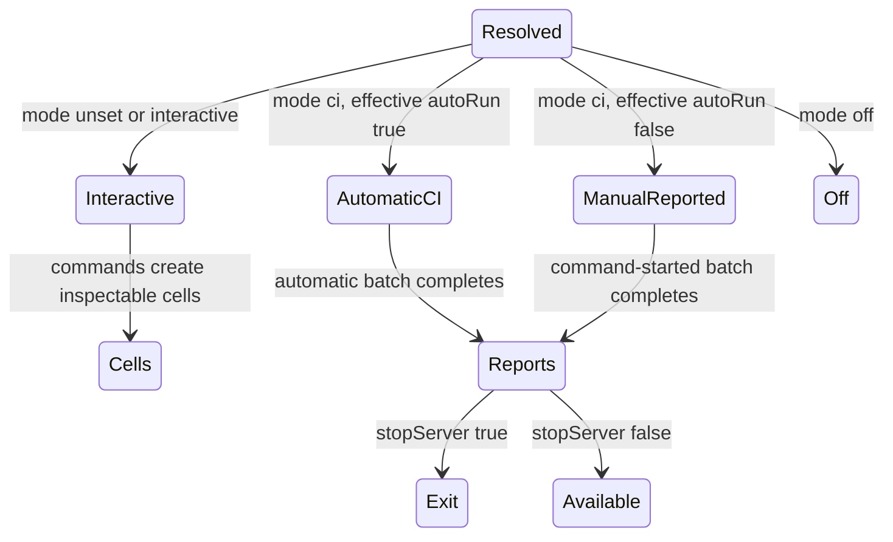

# Run tests

Horizon-QA starts in `interactive` mode when `horizonqa.mode` is not set. This is the normal choice while authoring tests.

## Start a development server

Run your mod's server task:

```bash
./gradlew runServer
```

For the repository examples:

```bash
./gradlew :examples:runServer
```

After joining with an operator account, run one test or a suite:

```text
/horizonqa run mymod:SmokeTests.emptyCellPasses
/horizonqa runall mymod
```

`/qa` is an alias for `/horizonqa`. Commands require permission level 2.

## Inspect and rerun a failure

Interactive runs keep failed cells available for inspection.

| Command | Purpose |
|---|---|
| `/horizonqa tp <testId>` | Teleport to a placed test cell |
| `/horizonqa runthis` | Rerun the cell you are standing inside |
| `/horizonqa runthat` | Rerun the cell in your line of sight |
| `/horizonqa runfailed` | Rerun the tests that are currently failed in the interactive session |
| `/horizonqa pos` | Show world and test-local coordinates for the nearest cell |
| `/horizonqa clearall` | Remove placed cells and overlays |

A connected client can render status beacons, floating labels, highlight boxes, and block-difference markers. See [Debugging failed tests](../guide/debugging.md) for the full triage loop.

Interactive commands launch selected tests directly. They do not apply `batch` ordering or call `@BeforeBatch` and `@AfterBatch`. Use a [manually reported batch](#start-reported-batches-manually) when you need to reproduce that lifecycle locally.

## Run automatically in CI

Set the mode on the **Minecraft server JVM**:

```bash
./gradlew runServer \
  --mcJvmArgs="-Dhorizonqa.mode=ci -Dhorizonqa.reportDir=${PWD}/build/horizonqa"
```

RetroFuturaGradle forwards `--mcJvmArgs` to Minecraft. Passing `-Dhorizonqa.mode=ci` directly to Gradle sets it on the Gradle daemon, where Horizon-QA cannot read it.

The CI preset:

- uses Horizon-QA's void world by default,
- discovers and selects tests after server startup,
- runs the selection automatically,
- writes `TEST-horizonqa.xml` and `horizonqa-result.json`,
- requests process exit with code `0`, `1`, or `2`.

Use `horizonqa.tests` to select a namespace or exact test ID:

```bash
./gradlew runServer \
  --mcJvmArgs="-Dhorizonqa.mode=ci -Dhorizonqa.tests=mymod -Dhorizonqa.reportDir=${PWD}/build/horizonqa"
```

See [CI and JUnit reports](../guide/ci.md) for selectors, report schemas, optional tests, exit codes, and a GitHub Actions example.

## Start reported batches manually

Use CI mode with automatic startup execution disabled when you want reports but need to choose the batch in-game:

```bash
./gradlew runServer \
  --mcJvmArgs="-Dhorizonqa.mode=ci -Dhorizonqa.autoRun=false -Dhorizonqa.reportDir=${PWD}/build/horizonqa"
```

Then run `/horizonqa run`, `/horizonqa runall`, or `/horizonqa runfailed`. These commands write reports when the batch completes. In this mode, `runfailed` uses failures remembered from the most recent reported batch.

Interactive-only commands, including cell inspection and template editing, are unavailable in this configuration.

## Mode summary

| Mode | Default behavior |
|---|---|
| `interactive` | Commands and discovery enabled, no startup autorun, normal world policy |
| `ci` | Startup autorun, void world policy, reports, and process exit |
| `off` | Commands, discovery, runners, and test visuals inactive |



Modes are presets. Override individual choices when needed:

```text
-Dhorizonqa.world=normal
-Dhorizonqa.autoRun=false
-Dhorizonqa.stopServer=false
-Dhorizonqa.gridOrigin=0,128,0
```

The complete property table is in [JVM properties](../reference/jvm-flags.md).

## Create or edit a structure

Use the Horizon Wand and `/horizonqa export` when a test needs a reusable world fixture. `/horizonqa load` restores an existing template for editing. Both workflows are covered in [Structure templates](../guide/structures.md).

Event recording is enabled by default. Keep it enabled unless you are measuring recorder overhead, because the trace is the primary CI diagnostic. See [Test event log](../reference/events.md).
