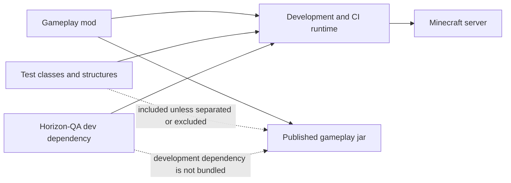

# Add Horizon-QA to your mod

## Gradle dependency

Add Horizon-QA to your mod's `dependencies.gradle` (or equivalent). It belongs on the **dev / CI classpath only**; release jars of gameplay mods should not bundle it.

```groovy
dependencies {
    devOnlyNonPublishable('com.github.GTNewHorizons:Horizon-QA:<version>:dev')
}
```

`devOnlyNonPublishable` is the GTNH convention for a dependency needed at both compile time and runtime without publishing it as a dependency of your release jar. Pin `<version>` to the Horizon-QA build used by your pack or meta-repository.

The `examples/` subproject in this repository shows the full runtime dependency set used by the framework demonstrations.

The dependency belongs on the same development and CI runtime as the tests, while the published gameplay jar remains independent:



## Runtime mode

Local server runs use interactive mode by default, so no JVM property is required for discovery or `/horizonqa` commands. A connected development client can also render test overlays.

Automated server runs should use CI mode on the Minecraft server JVM:

```text
./gradlew runServer --mcJvmArgs="-Dhorizonqa.mode=ci -Dhorizonqa.reportDir=${PWD}/build/horizonqa"
```

`--mcJvmArgs` is provided by RetroFuturaGradle. Passing `-Dhorizonqa.mode=ci` directly to Gradle, or wiring it as ordinary Gradle JVM arguments, sets it on the wrong JVM.

Use `-Dhorizonqa.mode=off` only when you want the mod on the classpath without commands, discovery, runner behavior, or test visuals. Batch execution, JUnit XML, and status JSON are server-side.

## Source layout

Recommended layout for a mod named `mymod`:

```text
src/main/java/.../tests/
  multiblock/<machine>/             # single-mod multiblock tests
  compatibility/<mod_a>_<mod_b>/    # cross-mod scenarios
src/main/resources/assets/mymod/horizonqastructures/
  ebf.json
  ebf.snbt   (optional; text structure data)
  ebf.nbt    (optional fallback; binary structure data)
```

!!! warning "Do not mirror `examples/` in a consumer mod"

    Framework examples belong only in this repository's `examples/` tree. Copying that layout name into a gameplay mod produces an undifferentiated test dump that does not scale. See [Package layout](../reference/package-layout.md) and [Design principles](../contributing/principles.md).

## Test discovery

Discovery is ASM-based at server start:

- Every class annotated `@GameTestHolder` is scanned.
- Every **public static** method annotated `@GameTest` with signature `void name(GameTestHelper)` is registered.
- Test ID format: `<holder.value>:<SimpleClassName>.<methodName>`

There is no manual registration list and no service-file step.

Invalid methods are excluded from the runnable set and logged with the validation reason. When an explicit CI selector targets an invalid or duplicate definition, the selection is reported as an infrastructure issue instead of silently matching nothing.

## Structure assets

Templates load from the classpath:

```text
/assets/<namespace>/horizonqastructures/<path>.json
/assets/<namespace>/horizonqastructures/<path>.snbt   (optional)
/assets/<namespace>/horizonqastructures/<path>.nbt    (optional fallback)
```

The loader also accepts legacy `<path>_tiles.nbt` and `<path>_entities.nbt` files.

`@GameTest(template = "ebf")` declared on a class with `@GameTestHolder("mymod")` resolves to `mymod:ebf`. Use `template = "othermod:shared/cell"` to reference a fully qualified template from another mod, or `templatePrefix` on the holder to share a prefix across a class.

## Optional: copy patterns from the examples

The `examples` subproject is the canonical reference:

- `BasicTests` for assertions, sequences, optional tests.
- `GTNHExampleTests` for EBF formation, EU supply, maintenance gating, synthetic recipes.
- `StructureTests` for template placement and block-level assertions.

Run `./gradlew :examples:runServer` to iterate against them.

## Publishing

Horizon-QA is **not** bundled in release jars of gameplay mods; keep it on development and CI classpaths.

The simple `src/main` layout shown above also places test classes and structure assets in your mod jar unless the build excludes them. If you want a release artifact with no test code, use a dedicated non-published test mod or Gradle subproject whose development run loads both the gameplay mod and Horizon-QA. The repository's `examples/` project demonstrates that separation pattern.
