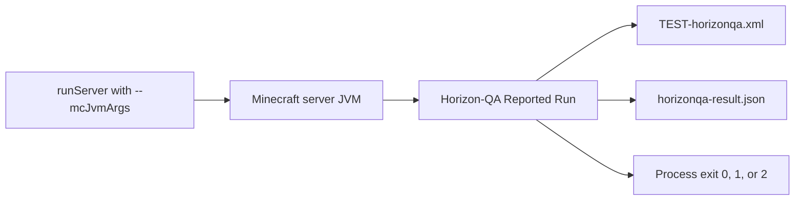

# CI and JUnit reports

Horizon-QA CI runs are normal dedicated-server runs with the Horizon-QA mode set on the **Minecraft server JVM**:

```text
./gradlew runServer --mcJvmArgs="-Dhorizonqa.mode=ci"
```

`--mcJvmArgs` is provided by RetroFuturaGradle (RFG). Repeat the option for each JVM argument; RFG does not split a quoted value on spaces. Do not pass `-Dhorizonqa.mode=ci` directly to Gradle; that sets the property on the Gradle daemon, where the Minecraft server cannot read it.

In `horizonqa.mode=ci`, Horizon-QA discovers tests, runs the selected batch automatically after the server is ready, writes reports, and exits the process with a deterministic status code. Local authoring should use `horizonqa.mode=interactive` or omit the mode property, because interactive is the default.



Use `horizonqa.mode=ci -Dhorizonqa.autoRun=false` when you want report files from a manually-started non-interactive batch without CI lifetime management:

```text
./gradlew runServer --mcJvmArgs=-Dhorizonqa.mode=ci --mcJvmArgs=-Dhorizonqa.autoRun=false --mcJvmArgs="-Dhorizonqa.reportDir=${PWD}/build/horizonqa"
```

Manual Reported Runs use the same report formats as automatic CI and default to the same void world policy. Then run
`/horizonqa run <testId>`, `/horizonqa runall [selector]`, or `/horizonqa runfailed`. The run writes JUnit XML and status
JSON when it finishes, but the server does not auto-run tests at startup and does not exit afterward. `horizonqa.tests`
and `horizonqa.allowNoTests` only affect automatic execution; for manual runs, use the command arguments to choose tests.

Modes are presets. Override specific behavior when the workflow needs it:

```text
# Use the configured or existing world instead of Horizon-QA's void world
./gradlew runServer --mcJvmArgs=-Dhorizonqa.mode=ci --mcJvmArgs=-Dhorizonqa.world=normal

# Run automatically but keep the server up afterward
./gradlew runServer --mcJvmArgs=-Dhorizonqa.mode=ci --mcJvmArgs=-Dhorizonqa.stopServer=false

# Place the test grid at Y=128
./gradlew runServer --mcJvmArgs=-Dhorizonqa.mode=ci --mcJvmArgs=-Dhorizonqa.autoRun=false --mcJvmArgs=-Dhorizonqa.world=normal --mcJvmArgs=-Dhorizonqa.gridOrigin=0,128,0

# Manual reported batches with CI overrides
./gradlew runServer --mcJvmArgs=-Dhorizonqa.mode=ci --mcJvmArgs=-Dhorizonqa.autoRun=false --mcJvmArgs="-Dhorizonqa.reportDir=${PWD}/build/horizonqa"

# Bounded tick acceleration during the reported batch
./gradlew runServer --mcJvmArgs=-Dhorizonqa.mode=ci --mcJvmArgs=-Dhorizonqa.turbo=10 --mcJvmArgs="-Dhorizonqa.reportDir=${PWD}/build/horizonqa"
```

`horizonqa.turbo` accepts `1` through `100` and defaults to `1`. A value above `1` runs that many complete server tick bodies per normal tick slot only while a reported batch is active under CI server behavior. It suppresses tick-scheduled autosaves and `Can't keep up!` warnings during that window. It does not accelerate interactive test sessions or leave the server accelerated after the batch.

## Report files

By default reports are written in the server process working directory:

```text
TEST-horizonqa.xml
horizonqa-result.json
```

For CI, send them to a predictable artifact directory:

```text
./gradlew runServer --mcJvmArgs=-Dhorizonqa.mode=ci --mcJvmArgs="-Dhorizonqa.reportDir=${PWD}/build/horizonqa"
./gradlew runServer --mcJvmArgs=-Dhorizonqa.mode=ci --mcJvmArgs=-Dhorizonqa.autoRun=false --mcJvmArgs="-Dhorizonqa.reportDir=${PWD}/build/horizonqa"
```

Report path flags:

| Property               | Meaning                                                                            |
|------------------------|------------------------------------------------------------------------------------|
| `horizonqa.reportDir`  | Directory containing `TEST-horizonqa.xml` and, by default, `horizonqa-result.json` |
| `horizonqa.reportFile` | Exact JUnit XML output path; takes precedence over `horizonqa.reportDir`           |
| `horizonqa.statusFile` | Exact status JSON output path                                                      |

Relative paths resolve from the Minecraft server process working directory, which GTNH projects normally set to `run/server` rather than the repository root. Use an absolute path in CI when later steps expect artifacts under the workspace. When `horizonqa.reportDir` is set and `horizonqa.statusFile` is not set, the status JSON is written to `horizonqa-result.json` in that same directory.

## JUnit XML

`TEST-horizonqa.xml` uses a standard JUnit-style `<testsuite>`:

```xml
<testsuite name="horizonqa" tests="…" failures="…" errors="…" skipped="…" …>
  <testcase name="methodName" classname="namespace:ClassName" time="…">
    <!-- failure, error, skipped, and system-out elements as appropriate -->
  </testcase>
</testsuite>
```

| Field        | Meaning                                |
|--------------|----------------------------------------|
| `classname`  | Test ID prefix, for example `mymod:AssemblerTests` |
| `name`       | Method name, with `[caseName]` for a parameterized case |
| `time`       | Duration in seconds (`testTicks / 20`) |

Required assertion failures and timeouts are emitted as `<failure>`. Infrastructure problems known before JUnit writing, such as cleanup, template, configuration, selection, and report-path failures, are emitted as `<error>`. Optional failures and intentional skips are emitted as `<skipped>` so JUnit publishers can show them without failing the suite aggregate. Intentional skips put their reason in the element's `message` attribute.

Reports are attempted once in order: console, status JSON, then JUnit XML. A report-sink failure is added to the run result for later sinks and the process exit code, so JUnit describes any console or status-reporting failure. If JUnit itself fails, no JUnit artifact can describe that failure.

Parameterized cases include a `parameters=[…]` line in `<system-out>`. When event recording is enabled, each
`<testcase>` may also include ordered `[t=NNN] [category] summary` lines there. The server console prints a compact
failure tail.

Disable event recording only for performance investigations:

```text
-Dhorizonqa.events=off
```

## Status JSON schema

`horizonqa-result.json` is the compact automation surface. Schema version `3` has this top-level shape:

```json
{
  "schemaVersion": 3,
  "status": "passed",
  "exitCode": 0,
  "configuration": {
    "mode": "ci",
    "rawMode": "ci",
    "world": "void",
    "rawWorld": null,
    "autoRun": true,
    "rawAutoRun": null,
    "stopServer": true,
    "rawStopServer": null,
    "turbo": 1,
    "rawTurbo": null,
    "gridOrigin": "0,64,0",
    "rawGridOrigin": null,
    "tests": null,
    "selectsAllTests": true,
    "allowNoTests": false,
    "eventsEnabled": true,
    "reportFile": null,
    "reportDir": "/workspace/project/build/horizonqa",
    "statusFile": null
  },
  "counts": {
    "selectedTests": 1,
    "passed": 1,
    "failed": 0,
    "timedOut": 0,
    "skipped": 0,
    "incomplete": 0,
    "requiredFailures": 0,
    "optionalFailures": 0,
    "issues": 0,
    "diagnosticErrors": 0,
    "junitFailures": 0,
    "junitErrors": 0,
    "junitSkipped": 0
  },
  "reports": {
    "junit": "/workspace/project/build/horizonqa/TEST-horizonqa.xml",
    "status": "/workspace/project/build/horizonqa/horizonqa-result.json"
  },
  "issues": [],
  "tests": []
}
```

Each `issues[]` entry contains `id`, `kind`, `source`, `name`, `message`, `fatalInCi`, and optional `details` /
`stackTrace`. Each `tests[]` entry contains `id`, `classname`, `name`, `status`, `required`, `ticks`, `timeSeconds`,
optional `parameters` for a parameterized case, optional `output` lines, optional `blockedByIssueId`, optional
`failure` details, or `skipReason` / `skipType` for an intentional skip.

Schema version `3` adds the per-test `output` array. It contains the same parameter, warning, and ordered event
lines used for JUnit `<system-out>`; the field is omitted when there is no output. Schema version `2` added the
`skipped` count, the per-test `skipped` status, and `skipReason` / `skipType`.

Status values are:

| JSON `status` | Exit code | Meaning                                                                                                      |
|---------------|-----------|--------------------------------------------------------------------------------------------------------------|
| `passed`      | `0`       | No required failures and no infrastructure errors                                                            |
| `failed`      | `1`       | At least one required test failed or timed out                                                               |
| `error`       | `2`       | Infrastructure, configuration, selection, template, cleanup, reporting, report-path, or incomplete-run error |

## Selectors

Use `horizonqa.tests` to limit automatic execution:

```text
-Dhorizonqa.tests=mymod
-Dhorizonqa.tests=AssemblerTests
-Dhorizonqa.tests=mymod:AssemblerTests
-Dhorizonqa.tests=mymod:AssemblerTests.processes
-Dhorizonqa.tests=mymod:AssemblerTests.processesOneRecipe
-Dhorizonqa.tests=mymod,compatmod:BridgeTests.basic
```

Selector grammar:

```text
selectors := selector ("," selector)*
selector  := unqualified-selector | test-id-prefix
unqualified-selector := token-without-colon
test-id-prefix := namespace ":" class-or-method-prefix
```

Rules:

- unset or empty `horizonqa.tests` selects all valid tests,
- an unqualified selector matches either a namespace or a holder's simple or fully qualified class name,
- a test-ID prefix must contain exactly one `:` and matches every valid test ID that starts with it,
- a full test ID remains valid and normally selects one test,
- whitespace around comma-separated tokens is trimmed,
- empty tokens such as `a,,b` are invalid,
- `*` is not supported; omit the property or set it to an empty value to run everything,
- duplicate selections are de-duplicated while preserving discovery order.

For automatic execution, invalid selector syntax aborts before tests run and exits `2`. A syntactically valid selector that matches no valid tests is reported as a CI infrastructure issue; if other selectors match valid tests, those tests still run and the final result still includes the selector issue.

If no valid tests are selected automatically, CI still writes `TEST-horizonqa.xml` and `horizonqa-result.json`. By default this exits `2`. Set `-Dhorizonqa.allowNoTests=true` only for jobs where an empty selection is expected and there are no selector infrastructure issues. Manual reported batches ignore these selector properties and use `/horizonqa run`, `/horizonqa runall [selector]`, or `/horizonqa runfailed` arguments instead.

## Optional tests

`@GameTest(required = false)` marks a test as optional. Optional tests still run, appear in JUnit XML, and appear in `tests[]` in the status JSON with `required: false`.

An optional failure or timeout:

- increments `counts.optionalFailures`,
- is represented as `<skipped>` in JUnit XML,
- does not make the process exit non-zero by itself.

Use optional tests for genuinely quarantined, experimental, or environment-specific coverage. Required tests should gate merges.

## Intentional skips

A test is intentionally skipped when its holder has a missing `requiredMods` entry or a runtime `assumeTrue` / `assumeFalse` precondition is unmet. Intentional skips:

- increment `counts.skipped`,
- use per-test status `skipped`,
- include `skipReason` and `skipType` in status JSON,
- emit `<skipped message="…">` in JUnit XML,
- do not change the process exit code by themselves.

Setup-blocked cases remain `notStarted` with `blockedByIssueId`; they are not intentional assumptions and their underlying infrastructure issue still produces exit code `2`.

If the server stops or reported execution aborts before completion, active cases become `error` with failure type
`EXECUTION_ABORTED`. Selected cases that did not start remain `notStarted` and reference the fatal run-level abort issue.
The run still attempts batch and instance cleanup, writes its reports, and exits with infrastructure status `2`; a
server-stopping callback never starts a second process exit.

## GitHub Actions handling

Always upload reports with `if: always()` so failed tests still leave artifacts. Publish JUnit XML from a later `always()` step, then let the original `runServer` exit code fail the job.

```yaml
name: Horizon-QA

on:
  pull_request:
  push:
    branches: [ master, main ]

jobs:
  gametest:
    runs-on: ubuntu-latest
    steps:
      - uses: actions/checkout@v4

      - uses: actions/setup-java@v4
        with:
          distribution: temurin
          java-version-file: .java-version

      - uses: gradle/actions/setup-gradle@v4

      - name: Run Horizon-QA
        run: >
          ./gradlew runServer
          --mcJvmArgs=-Dhorizonqa.mode=ci
          --mcJvmArgs="-Dhorizonqa.reportDir=${{ github.workspace }}/build/horizonqa"

      - name: Upload Horizon-QA reports
        if: always()
        uses: actions/upload-artifact@v4
        with:
          name: horizonqa-reports
          path: |
            build/horizonqa/TEST-horizonqa.xml
            build/horizonqa/horizonqa-result.json
```

If your workflow uses a JUnit publishing action, run it after the upload step with `if: always()` and point it at `build/horizonqa/TEST-horizonqa.xml`.

## When CI fails

Work from the artifacts before relaunching anything: the `<failure>` message, the event trace in `<system-out>`, and `issues[]` in the status JSON usually identify the cause on their own. The triage workflow, including a failure-signature table and the in-game reproduction loop, is in [Debugging failed tests](debugging.md).

```text
read TEST-horizonqa.xml → identify failed test ID → runServer (interactive)
                        → /horizonqa run <testId> → fix → /horizonqa runthis → push
```

`/horizonqa runfailed` repeats failures remembered in the current runtime; it does not
read a downloaded CI report. If batch hooks matter, use the manual Reported Run
instructions above instead.

## Automated client tests

Client tests run a real Minecraft 1.7.10 client and integrated server. They need a working graphics context. Displayless execution is not supported by the local Windows launcher.

Use `@GameTestHolder(value = "mymod", clientOnly = true)` on a separate holder. Its methods still receive `GameTestHelper` and run on the server thread. Client mode selects only client holders. Normal server discovery filters those holders from Forge ASM metadata before class loading. Explicitly selecting an unavailable client test on a dedicated server produces a selection error, not a skipped pass.

### Write a client scenario

Use `ClientTest.scenario(helper)` to build the test as one ordered chain:

```java
ClientTarget next = ClientTarget.of("details.next", c -> findNextButton(c));

ClientTest.scenario(helper)
    .useHeldItem()
    .awaitScreen(MyScreen.class)
    .click(next)
    .awaitScreen(DetailsScreen.class)
    .capture("details")
    .escape()
    .succeed();
```

The screen types and `findNextButton` belong to the consumer. The lookup returns a live `ClickTarget`, including visible bounds and actual hit-test readiness. Creating a `ClientTarget` stores its description and resolver without querying the GUI. It can be reused across steps even when the screen or layout changes.

Scenario methods register deferred steps on the existing server-owned `GameTestSequence`. Building the chain does not perform input. It creates one client session and one sequence, so do not also call `attach(helper)` or `helper.startSequence()` for that test. Finish registration with `succeed()`.

### One unattended command

From this repository on Windows:

```powershell
.\scripts\run-client-tests.ps1 -Tests 'horizonqaexamples:ClientSmokeTests.clickEscapeAndReopen'
```

The launcher creates a fresh report directory, starts `:examples:runClient` at 1280 by 720, selects the named tests, and enforces a 600-second wall-clock deadline. It prints a JSON result and returns the existing exit codes: `0` for success, `1` for required test failure, and `2` for infrastructure failure or an incomplete run. An intentional failure example is `horizonqaexamples:ClientSmokeTests.intentionalFailure`.

For a consumer checkout using a local development JAR:

```powershell
.\scripts\run-client-tests.ps1 `
    -ProjectRoot C:\path\to\consumer `
    -Task runClient `
    -Tests 'mymod:ScreenTests.openAndReturn' `
    -HorizonQaJar C:\path\to\horizonqa-dev.jar
```

`-HorizonQaJar` forwards `-PhorizonQaJar` to the consumer build. That consumer must explicitly configure its development dependency and opt-in test sources for the property. Horizon does not change consumer packaging. Keep client test classes out of normal published artifacts.

Use `-GradleArguments @('-PusesMixinDebug=false')` for additional build options. The launcher preserves each array entry as one argument. Do not override its client mode, selection or unique report directory, which identify the owned process and result.

`-ReportDir` must name a new directory. `-TimeoutSeconds` bounds the whole launch including Gradle preparation. `-ShutdownSeconds` defaults to 20. On expiry the launcher requests orderly shutdown with a marker in that run's report directory and attempts a bounded thread dump. If shutdown fails, it may terminate only the matching client PID after verifying its creation time and unique report path. It does not terminate shared Gradle daemons or unrelated Java processes.

The underlying JVM opt-in is `-Dhorizonqa.client=true` together with `-Dhorizonqa.mode=ci` and `-Dhorizonqa.world=normal`. Each property must use its own `--mcJvmArgs`. Existing test selectors apply. Auto-run and shutdown must be enabled and turbo must be 1. The local client bootstrap uses a flat creative world, so void-world overrides and server turbo are rejected. No matching tests is an error even when `horizonqa.allowNoTests=true`.

Bootstrap creates a new `horizonqa-<UUID>` scratch save under the launcher's client working directory. It never chooses an existing save. One launch reuses this world and client across the selected scenarios. Scenarios execute serially within their existing batch hooks. Bootstrap requests GUI scale 1, but GUI libraries may apply their own scale, so resolve targets using the active screen's dimensions and live widget geometry. Test mode suppresses the renderer's automatic focus-loss pause without changing the focus-pause setting, so closing a screen cannot reopen the pause menu just because the window is inactive. Test mode also suppresses native cursor grabbing. The client world and integrated server keep ticking and synchronizing even while an explicitly opened pausing screen is visible. The screen remains usable and is not automatically dismissed. The original GUI scale is restored during orderly shutdown. Scratch saves remain in the development run directory for inspection.

`ClientPauseTests.inactiveWindowAllowsWorldInputAfterScreenCleanup` exercises an inactive game window with `pauseOnLostFocus=true`, real book input after closing a screen, and explicit pause-menu handling through Escape. Keep the game window visible and focus another application when running this regression. It fails its precondition if the game stays active.

### Server and client operations

Mix server fixture work, native client input and client assertions in the same scenario:

```java
@GameTestHolder(value = "mymod", clientOnly = true)
public final class ScreenTests {
    @GameTest(template = "screen_fixture", timeoutTicks = 400)
    public static void openAndReturn(GameTestHelper helper) {
        ClientTarget next = ClientTarget.of("details.next", c -> findNextButton(c));
        ClientTest.scenario(helper)
            .server("prepare server fixture", () -> {
                helper.setBlock("marker", Blocks.gold_block);
            })
            .afterTest(c -> removeTestOwnedClientState())
            .client("open fixture screen", c -> {
                Minecraft.getMinecraft().displayGuiScreen(new MyScreen());
            })
            .click(next)
            .awaitScreen(DetailsScreen.class)
            .capture("details")
            .escape()
            .server("verify server state", () -> {
                helper.assertBlockPresent(Blocks.gold_block, "marker");
            })
            .succeed();
    }
}
```

The screen types and lookup methods above belong to the consumer. Opening a supplied fixture screen is appropriate for a framework input test. Product scenarios should enter their screen through normal gameplay, for example with `useHeldItem()`. The runnable framework examples are in `examples`.

`ClientScenario`, `ClientTarget` and `ClientTest` live in `com.gtnewhorizons.horizonqa.api.client`. Custom `client` actions execute at client END, and completion is consumed at server END. `server` actions execute on the server at END. Do not capture live server worlds or tile entities in a client action. Pass immutable values between the two sides and perform server assertions in `server` or `awaitServer`.

| Scenario method | Contract |
|---|---|
| `useHeldItem()` | Use the equipped item through its configured world-input binding |
| `awaitScreen(type)` | Wait until the active screen has the requested type |
| `click(target)`, `rightClick(target)`, `shiftClick(target)` | Resolve a live target and dispatch a left, right or Shift-left click |
| `scroll(target, delta)` | Dispatch one signed native wheel event at a live target |
| `drag(target).to(endpoint).overFrames(n)` | Hold the mouse through rendered movement frames and release at the endpoint |
| `key(code, character)`, `escape()` | Dispatch native key input through the active screen |
| `capture(checkpoint)` | Wait for a rendered PNG checkpoint to be written |
| `client(label, action)`, `server(label, action)` | Run a custom action once on the indicated thread |
| `awaitClient(label, assertion)`, `awaitServer(label, assertion)` | Retry assertions on the indicated thread |
| `async(label, action)`, `awaitAsync(label, assertion)` | Await custom asynchronous work once or retry completed assertion failures |
| `afterTest(cleanup)` | Register client cleanup when this step executes |
| `serverSequence()` | Access this scenario's existing sequence for advanced scheduling |
| `succeed()` | Append the success step and finish authoring |

#### Budgets and step descriptions

Client operations and assertion waits default to **100 test ticks per step**. The test's `@GameTest(timeoutTicks = ...)` still bounds the whole scenario. Native operations generate descriptions from the action and target name.

```java
ClientTest.scenario(helper)
    .defaultTimeoutTicks(80)
    .step("save the edited recipe")
    .withinTicks(160)
    .click(save)
    .awaitClient("confirmation is visible", c -> assertConfirmation(c))
    .succeed();
```

`step(label)` overrides only the next step's description, including an explicit custom label. `withinTicks(n)` overrides only the next bounded step's budget. In this example the click has 160 ticks, and the assertion returns to the 80-tick default. Budgets must be positive. A synchronous `server` action has no tick budget, so placing `withinTicks` before it is rejected. Consume pending options before `succeed()` or `serverSequence()`.

#### Custom operations

Use `client` and `awaitClient` for client observations and assertions. Use `async` when an operation already returns a completion stage or needs a specialized composition:

```java
scenario.async("verify a rejected input", c -> c.useHeldItem().handle((ignored, error) -> {
    assertExpectedRejection(error);
    return null;
}));
scenario.awaitAsync("external result is available", c -> checkExternalResultAsync());
```

The `async` and `awaitAsync` callbacks themselves begin on the **server thread**. Queue client work through the supplied `ClientTest`, such as `c.run(...)` or its input methods. Do not read Minecraft client state directly in these callbacks.

Advanced server scheduling uses the same sequence:

```java
var scenario = ClientTest.scenario(helper);
scenario.serverSequence()
    .thenExecuteAtStart(() -> supplyFixtureInput());
scenario.useHeldItem()
    .awaitServer("operation completed", () -> assertServerResult())
    .succeed();
```

Finish registering raw sequence steps before returning to the fluent chain. Existing START/END ordering rules still apply. There is no second executor or separate cleanup lifecycle.

### Low-level client operations

`ClientTest.attach(helper)` remains available when authoring directly with `GameTestSequence`. Attach at most one session per test. The fluent scenario uses this same session internally. Low-level methods are also available through custom callbacks for specialized input and future composition. They are an advanced API, not a deprecated compatibility layer.

`run(Consumer<ClientTest>)` returns `CompletableFuture<Void>` and queues work at client END. Its completion is consumed by the sequence on server END.

| Client method | Contract |
|---|---|
| `screen()` | Real current screen, possibly null, inside a client action |
| `screen(Class<T>)` | Assert and return its type, with the observed class in failure output |
| `useHeldItem()` | Press the configured use-item control through normal world input, release it on the next client tick, and complete after processing |
| `click(button, target)` | Resolve a `java.awt.Point` on the client thread, position the virtual pointer, await a normal frame, then dispatch press/release through `GuiScreen.handleInput` |
| `click(button, target, ready)` | Also await a consumer `Predicate<ClientTest>` before dispatch, for cached hover/hit-test state |
| `shiftClick(button, target, ready)` | The same awaited click while Shift is held through mouse press and release |
| `click(button, description, resolver)` | Repeatedly resolve a live `ClickTarget`, wait for visible bounds and actual hit-test readiness, then dispatch a real click |
| `shiftClick(button, description, resolver)` | The same dynamically resolved click with Shift held through mouse release |
| `scroll(wheelDelta, description, resolver)` | Resolve a live target and dispatch one mouse-wheel event at its current position |
| `drag(button, description, start, end, frames)` | Resolve a live start target, hold the button through rendered movement frames, then release at a plain screen-coordinate endpoint |
| `escape()` | Escape press and release through the current screen's keyboard dispatch |
| `key(keyCode, character)` | Queue one LWJGL key press with a typed character, followed by release through the active screen |
| `afterTest(Runnable)` | Register client cleanup inside a client action |
| `capture(checkpoint)` | Await a rendered PNG and obtain its `File` path |

Click once, then wait for the resulting state in a separate step. Async waits retry only completed `AssertionError`s. An operation still in flight is never resubmitted. Unexpected exceptions fail with their original cause. Step budgets include time spent waiting for client work. Never block either game thread with `join`, `get`, sleeps, or manual polling loops. Completion callbacks run on their completing thread, so use another sequence step for server work.

GUI libraries can update hit-test caches on a clock separate from rendering. For those controls, pass a `ready` predicate based on the library's public observable state. For example, a ModularUI consumer can check whether its panel considers the uniquely located target widget below the mouse. False keeps the click pending without dispatching input. A thrown exception fails immediately. The enclosing sequence's tick budget bounds this readiness wait, and diagnostics retain the pending point. No extra frame count or fixed delay is required.

### Input and rendering

The supported input seam is LWJGL 2.9: Horizon supplies both queued events and polled button/key state, plus event and polled cursor coordinates. A click waits for a normal rendered frame at the target before pressing, so libraries that record hover coordinates during rendering observe the new pointer. Normal `GuiScreen.handleInput` dispatch invokes the screen lifecycle. There is no OS mouse automation and no direct widget business callback. Unsupported LWJGL layouts fail explicitly. Complete clicks, Shift-clicks, scrolling, straight drags and individual keys with typed characters are supported. Whole-string entry and arbitrary held-key gestures are outside this version.

Use `shiftClick` for interactions such as NEI's modifier-assisted recipe transfer. Shift press is dispatched through the real screen keyboard path and is visible through `Keyboard.isKeyDown` and `GuiScreen.isShiftKeyDown` during both mouse callbacks. The helper dispatches Shift release after the mouse release and clears held input even if a callback throws. It does not change NEI preferences or invoke recipe-transfer handlers directly.

### Sending a single key

Use `.key(Keyboard.KEY_SPACE, ' ')` for a Space shortcut or `.key(Keyboard.KEY_B, 'b')` to type a character in a scenario:

```java
scenario.key(Keyboard.KEY_SPACE, ' ')
    .click(searchField)
    .key(Keyboard.KEY_B, 'b')
    .client("search contains b", c -> assertSearchText(c, "b"));
```

The keycode is a nonzero LWJGL key constant. Pass `'\0'` for non-text keys. Horizon delivers the press with its character, then releases the key and clears held input even if a handler fails or closes the screen. An active GUI is required. The consumer selects focus through its own GUI interactions, such as clicking a text field, and separately asserts the result. This operation does not type whole strings or choose a focused widget. The scenario's `escape()` schedules the same dispatch path on the client thread. World interactions still use `useHeldItem()` and the configured use binding. `ClientKeyTests` exercises a Space shortcut, native text-field entry, Escape and handler-failure cleanup.

### Dragging from a live target

`drag(target).to(endpoint).overFrames(frames)` uses the same `ClientTarget` lookup and readiness as clicks for its start. The endpoint resolver returns a `java.awt.Point` in the active screen's coordinates and runs once immediately before the press. It can identify empty space and does not need a clickable widget. The positive `frames` argument controls the number of movement frames along a straight path. Each position is rendered with the button held before Horizon dispatches its motion event through normal screen input handling.

```java
ClientTarget handle = ClientTarget.of("toolbar handle", c -> findToolbarHandle(c));
scenario.drag(handle)
    .to(c -> new Point(c.screen().width / 2, c.screen().height / 2))
    .overFrames(6);
```

`findToolbarHandle` belongs to the consumer and returns a live `ClickTarget`. The drag defaults to the left button. Use `.button(index)` to select another LWJGL mouse button or `.to(x, y)` for a fixed GUI-coordinate endpoint. `overFrames` registers the gesture and returns the scenario. The next step waits for the drag to finish. Assert the resulting state in a separate step. Completion confirms dispatch and release, not acceptance by the GUI. A replacement screen, resize or handler failure aborts the drag and clears held input. Test teardown also releases the gesture. `ClientDragTests` contains runnable cases for movement across rendered frames, handler failure and screen replacement.

### Scrolling a live target

Use `scenario.scroll(panel, -120)` to scroll a live `ClientTarget` through the view's normal mouse handler. It uses the same live target lookup, rendered frame and hit-test readiness as semantic clicks. The delta is in raw signed LWJGL units, conventionally `120` upward or `-120` downward per notch. Horizon dispatches exactly one event with the supplied magnitude. Zero is rejected. The GUI decides what that event means, so wait for the resulting state in a separate sequence step. Completion confirms input dispatch and cleanup, not that the view moved. `ClientWheelTests` provides runnable moving-target and handler-failure cases.

### Using an item from the world

Use `.useHeldItem()` in a scenario to enter a GUI or perform a world interaction through normal input. A fixture may equip the player and prepare their position and aim. The operation requires an active world and player, a held item and no active screen. Missing prerequisites fail with a diagnostic instead of silently closing a screen or choosing an item.

```java
scenario.awaitClient("map equipped on client", c -> assertMapEquipped())
    .useHeldItem()
    .awaitClient("map visible", c -> assertMapScreen(c.screen()));
```

The assertions in this example belong to the consumer. `WorldInputTests` in `examples` provides runnable cases using a real written book equipped on the server and synchronized to the client.

Horizon reads the current use-item keybinding, which may be a mouse button or keyboard key. It supplies a press before a normal client tick and a release before the next tick. Minecraft processes those events through its normal input loop, including Forge input hooks. Horizon does not call the player controller, the item's use handler or a GUI factory to perform the action. Normal aiming still applies, so a block or entity under the crosshair may handle the interaction.

The future completes at client END after release processing. It proves that the input action finished, not that the item use was accepted. A mod may cancel input. Always assert the resulting state separately. These two input phases describe a press/release lifecycle, not a fixed wait for gameplay to finish.

Cleanup clears LWJGL state and Minecraft's cached keybinding state. A test failure invalidates pending work and releases input during client teardown before the next scenario. This action does not provide movement, arbitrary key gestures or continuous item use.

Core has no ModularUI, NEI, or consumer dependency. Resolve controls using the consumer's actual widget tree, visibility and clipping rules. Ambiguous controls must fail before clicking. The generic helper checks screen bounds but cannot infer widget identity or whether a library-specific rectangle is occluded.

### Targets that follow the live GUI

Define a reusable `ClientTarget` when an element can appear later or move during rendering. The resolver runs on each client tick until the click can be dispatched. It returns a `ClickTarget` from `com.gtnewhorizons.horizonqa.api.client`, or `null` while the element is absent, hidden or disabled. Throw an exception when the lookup is ambiguous or invalid. Exceptions from discovery and hit testing fail immediately with their original cause.

```java
ClientTarget saveTarget = ClientTarget.of("recipe-editor.save", c -> {
    if (!(c.screen() instanceof RecipeScreen)) return null;
    RecipeScreen screen = (RecipeScreen) c.screen();
    // These lookup and hit-test methods belong to the consumer's GUI integration.
    Control save = screen.findUniqueControl("recipe-editor.save");
    if (save == null || !save.isVisible() || !save.isEnabled()) return null;
    return new ClickTarget(save, save.visibleBounds(), () -> screen.isActualMouseTarget(save));
});
scenario.click(saveTarget);
```

The description identifies the pending target in failure diagnostics. Discovery uses stable widget names or domain keys, scoped to the correct panel, instead of translated labels or list indices. For example, two panels may both contain a Save button. The resolver must distinguish them and reject multiple matches within its scope.

If a target ID comes from a fixture created during execution, compute that ID inside the resolver too. For example, use `ClientTarget.of("created asset action", c -> findAction(createdAssetId()))` rather than calling `createdAssetId()` while building the scenario. Java evaluates ordinary method arguments immediately, even when the called helper returns a deferred target. Wait for the fixture ID to be available and safely publish it before the client reads it. The target description can remain a stable label.

`ClickTarget(identity, visibleBounds, ready)` represents one current observation:

- `identity` is a live widget or a stable domain key compared with `Objects.equals`. Do not create a fresh identity object on every lookup.
- `visibleBounds` is a `java.awt.Rectangle` in the current `GuiScreen` coordinate system. Apply parent clipping before returning it. Horizon copies it and intersects it with the screen. Empty or off-screen areas keep waiting.
- `ready` checks the GUI's actual hit test for that element at the positioned pointer. It runs on the client thread after a normal rendered frame. Check overlap and cached hover state here. It must not invoke the element's action.

Horizon positions the pointer at the center of the visible area, awaits a normal completed frame, and resolves the target again before dispatch. A changed screen, screen dimensions, identity, or area that no longer contains the pointer causes repositioning and another frame. A continuously moving target can still be clicked if the current area contains the pointer and the real hit test accepts it. Resolvers and readiness checks observe GUI state and must not change the active screen or perform input.

The existing sequence budget bounds absence, clipping, motion and hit-test readiness together. Timeout diagnostics retain the target description and last wait reason. Horizon does not automatically scroll or open menus. Express those navigation actions explicitly before targeting an element outside the current view.

The runnable `ClientTargetTests` examples exercise a button that moves after pointer positioning, continuous motion and a resolver error that must not dispatch input. Existing point-based overloads remain available for fixed locations and existing integrations.

Frame capture reads the completed display framebuffer immediately before Minecraft's buffer swap. Pixel acquisition stays on the render thread. PNG encoding and file writes run asynchronously, and the future completes only after the file is written. Explicit checkpoints and the final diagnostic frame are retained under the test's artifact directory. Horizon does not compare screenshots or prove texture correctness merely from screen presence.

### Failure and cleanup

Existing JUnit XML and status JSON include the scenario, labeled step, tick budget, original exception stack, last screen and artifact paths. A client update/render exception remains the primary failure. If no completed frame exists after that exception, capture is skipped with a diagnostic instead of presenting a partial frame as valid evidence.

A request to open Minecraft's pause menu records the caller stack, previous screen, stored and reported pause state, display activity, logical game focus, focus-pause setting and GUI scale. These diagnostics are captured throughout the client-test run, including before a test attaches. They appear in the launch log and in the active case's output when a case exists. An intentional pause-menu test remains valid. An unexpected menu is diagnostic evidence and is not silently closed. `ClientPauseTests.serverInventorySynchronizesWhilePauseMenuRemainsOpen` verifies a real server inventory update while the menu stays open, followed by closing it through Escape input.

Ending a test invalidates queued client work immediately. An already claimed action may finish on the client thread. Client teardown then releases input, runs registered client cleanup and closes the screen. Server cleanup and the next test wait for teardown and final artifact writing. Teardown failure or its 100-tick deadline makes the run an infrastructure failure and prevents subsequent client scenarios from starting.

`GameTestHelper.afterTestAsync(maxTicks, supplier)` owns the single asynchronous teardown slot. The client session uses it, so consumers register client cleanup through the scenario's `afterTest(c -> ...)` or the low-level `ClientTest.afterTest` inside a client action. Registration is deferred until the scenario cleanup-registration step executes. If setup captures state for restoration, register its cleanup inside that same client setup callback. Ordinary `helper.afterTest` callbacks continue to run on the server thread after client teardown.

Tick budgets cannot detect a frozen game loop. Use the bounded launcher for unattended runs and retain `launch-result.json`, `launch.log`, and any thread dump alongside the normal reports.
