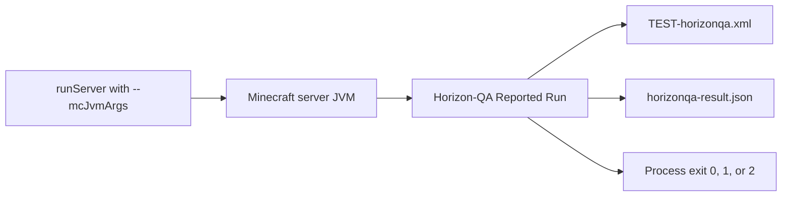

# CI and JUnit reports

Horizon-QA CI runs are normal dedicated-server runs with the Horizon-QA mode set on the **Minecraft server JVM**:

```text
./gradlew runServer --mcJvmArgs="-Dhorizonqa.mode=ci"
```

`--mcJvmArgs` is provided by RetroFuturaGradle (RFG). Repeat the option for each JVM argument; RFG does not split a quoted value on spaces. Do not pass `-Dhorizonqa.mode=ci` directly to Gradle; that sets the property on the Gradle daemon, where the Minecraft server cannot read it.

In `horizonqa.mode=ci`, Horizon-QA discovers tests, runs the selected batch automatically after the server is ready, writes reports, and exits the process with a deterministic status code. Local authoring should use `horizonqa.mode=interactive` or omit the mode property, because interactive is the default.



Use `horizonqa.mode=ci -Dhorizonqa.autoRun=false` when you want report files from a manually-started non-interactive batch without CI lifetime management:

```text
./gradlew runServer --mcJvmArgs=-Dhorizonqa.mode=ci --mcJvmArgs=-Dhorizonqa.autoRun=false --mcJvmArgs="-Dhorizonqa.reportDir=${PWD}/build/horizonqa"
```

Manual Reported Runs use the same report formats as automatic CI and default to the same void world policy. Then run
`/horizonqa run <testId>`, `/horizonqa runall [selector]`, or `/horizonqa runfailed`. The run writes JUnit XML and status
JSON when it finishes, but the server does not auto-run tests at startup and does not exit afterward. `horizonqa.tests`
and `horizonqa.allowNoTests` only affect automatic execution; for manual runs, use the command arguments to choose tests.

Modes are presets. Override specific behavior when the workflow needs it:

```text
# Use the configured or existing world instead of Horizon-QA's void world
./gradlew runServer --mcJvmArgs=-Dhorizonqa.mode=ci --mcJvmArgs=-Dhorizonqa.world=normal

# Run automatically but keep the server up afterward
./gradlew runServer --mcJvmArgs=-Dhorizonqa.mode=ci --mcJvmArgs=-Dhorizonqa.stopServer=false

# Place the test grid at Y=128
./gradlew runServer --mcJvmArgs=-Dhorizonqa.mode=ci --mcJvmArgs=-Dhorizonqa.autoRun=false --mcJvmArgs=-Dhorizonqa.world=normal --mcJvmArgs=-Dhorizonqa.gridOrigin=0,128,0

# Manual reported batches with CI overrides
./gradlew runServer --mcJvmArgs=-Dhorizonqa.mode=ci --mcJvmArgs=-Dhorizonqa.autoRun=false --mcJvmArgs="-Dhorizonqa.reportDir=${PWD}/build/horizonqa"

# Bounded tick acceleration during the reported batch
./gradlew runServer --mcJvmArgs=-Dhorizonqa.mode=ci --mcJvmArgs=-Dhorizonqa.turbo=10 --mcJvmArgs="-Dhorizonqa.reportDir=${PWD}/build/horizonqa"
```

`horizonqa.turbo` accepts `1` through `100` and defaults to `1`. A value above `1` runs that many complete server tick bodies per normal tick slot only while a reported batch is active under CI server behavior. It suppresses tick-scheduled autosaves and `Can't keep up!` warnings during that window. It does not accelerate interactive test sessions or leave the server accelerated after the batch.

## Report files

By default reports are written in the server process working directory:

```text
TEST-horizonqa.xml
horizonqa-result.json
```

For CI, send them to a predictable artifact directory:

```text
./gradlew runServer --mcJvmArgs=-Dhorizonqa.mode=ci --mcJvmArgs="-Dhorizonqa.reportDir=${PWD}/build/horizonqa"
./gradlew runServer --mcJvmArgs=-Dhorizonqa.mode=ci --mcJvmArgs=-Dhorizonqa.autoRun=false --mcJvmArgs="-Dhorizonqa.reportDir=${PWD}/build/horizonqa"
```

Report path flags:

| Property               | Meaning                                                                            |
|------------------------|------------------------------------------------------------------------------------|
| `horizonqa.reportDir`  | Directory containing `TEST-horizonqa.xml` and, by default, `horizonqa-result.json` |
| `horizonqa.reportFile` | Exact JUnit XML output path; takes precedence over `horizonqa.reportDir`           |
| `horizonqa.statusFile` | Exact status JSON output path                                                      |

Relative paths resolve from the Minecraft server process working directory, which GTNH projects normally set to `run/server` rather than the repository root. Use an absolute path in CI when later steps expect artifacts under the workspace. When `horizonqa.reportDir` is set and `horizonqa.statusFile` is not set, the status JSON is written to `horizonqa-result.json` in that same directory.

## JUnit XML

`TEST-horizonqa.xml` uses a standard JUnit-style `<testsuite>`:

```xml
<testsuite name="horizonqa" tests="…" failures="…" errors="…" skipped="…" …>
  <testcase name="methodName" classname="namespace:ClassName" time="…">
    <!-- failure, error, skipped, and system-out elements as appropriate -->
  </testcase>
</testsuite>
```

| Field        | Meaning                                |
|--------------|----------------------------------------|
| `classname`  | Test ID prefix, for example `mymod:AssemblerTests` |
| `name`       | Method name, with `[caseName]` for a parameterized case |
| `time`       | Duration in seconds (`testTicks / 20`) |

Required assertion failures and timeouts are emitted as `<failure>`. Infrastructure problems known before JUnit writing, such as cleanup, template, configuration, selection, and report-path failures, are emitted as `<error>`. Optional failures and intentional skips are emitted as `<skipped>` so JUnit publishers can show them without failing the suite aggregate. Intentional skips put their reason in the element's `message` attribute.

Reports are attempted once in order: console, status JSON, then JUnit XML. A report-sink failure is added to the run result for later sinks and the process exit code, so JUnit describes any console or status-reporting failure. If JUnit itself fails, no JUnit artifact can describe that failure.

Parameterized cases include a `parameters=[…]` line in `<system-out>`. When event recording is enabled, each
`<testcase>` may also include ordered `[t=NNN] [category] summary` lines there. The server console prints a compact
failure tail.

Disable event recording only for performance investigations:

```text
-Dhorizonqa.events=off
```

## Status JSON schema

`horizonqa-result.json` is the compact automation surface. Schema version `3` has this top-level shape:

```json
{
  "schemaVersion": 3,
  "status": "passed",
  "exitCode": 0,
  "configuration": {
    "mode": "ci",
    "rawMode": "ci",
    "world": "void",
    "rawWorld": null,
    "autoRun": true,
    "rawAutoRun": null,
    "stopServer": true,
    "rawStopServer": null,
    "turbo": 1,
    "rawTurbo": null,
    "gridOrigin": "0,64,0",
    "rawGridOrigin": null,
    "tests": null,
    "selectsAllTests": true,
    "allowNoTests": false,
    "eventsEnabled": true,
    "reportFile": null,
    "reportDir": "/workspace/project/build/horizonqa",
    "statusFile": null
  },
  "counts": {
    "selectedTests": 1,
    "passed": 1,
    "failed": 0,
    "timedOut": 0,
    "skipped": 0,
    "incomplete": 0,
    "requiredFailures": 0,
    "optionalFailures": 0,
    "issues": 0,
    "diagnosticErrors": 0,
    "junitFailures": 0,
    "junitErrors": 0,
    "junitSkipped": 0
  },
  "reports": {
    "junit": "/workspace/project/build/horizonqa/TEST-horizonqa.xml",
    "status": "/workspace/project/build/horizonqa/horizonqa-result.json"
  },
  "issues": [],
  "tests": []
}
```

Each `issues[]` entry contains `id`, `kind`, `source`, `name`, `message`, `fatalInCi`, and optional `details` /
`stackTrace`. Each `tests[]` entry contains `id`, `classname`, `name`, `status`, `required`, `ticks`, `timeSeconds`,
optional `parameters` for a parameterized case, optional `output` lines, optional `blockedByIssueId`, optional
`failure` details, or `skipReason` / `skipType` for an intentional skip.

Schema version `3` adds the per-test `output` array. It contains the same parameter, warning, and ordered event
lines used for JUnit `<system-out>`; the field is omitted when there is no output. Schema version `2` added the
`skipped` count, the per-test `skipped` status, and `skipReason` / `skipType`.

Status values are:

| JSON `status` | Exit code | Meaning                                                                                                      |
|---------------|-----------|--------------------------------------------------------------------------------------------------------------|
| `passed`      | `0`       | No required failures and no infrastructure errors                                                            |
| `failed`      | `1`       | At least one required test failed or timed out                                                               |
| `error`       | `2`       | Infrastructure, configuration, selection, template, cleanup, reporting, report-path, or incomplete-run error |

## Selectors

Use `horizonqa.tests` to limit automatic execution:

```text
-Dhorizonqa.tests=mymod
-Dhorizonqa.tests=AssemblerTests
-Dhorizonqa.tests=mymod:AssemblerTests
-Dhorizonqa.tests=mymod:AssemblerTests.processes
-Dhorizonqa.tests=mymod:AssemblerTests.processesOneRecipe
-Dhorizonqa.tests=mymod,compatmod:BridgeTests.basic
```

Selector grammar:

```text
selectors := selector ("," selector)*
selector  := unqualified-selector | test-id-prefix
unqualified-selector := token-without-colon
test-id-prefix := namespace ":" class-or-method-prefix
```

Rules:

- unset or empty `horizonqa.tests` selects all valid tests,
- an unqualified selector matches either a namespace or a holder's simple or fully qualified class name,
- a test-ID prefix must contain exactly one `:` and matches every valid test ID that starts with it,
- a full test ID remains valid and normally selects one test,
- whitespace around comma-separated tokens is trimmed,
- empty tokens such as `a,,b` are invalid,
- `*` is not supported; omit the property or set it to an empty value to run everything,
- duplicate selections are de-duplicated while preserving discovery order.

For automatic execution, invalid selector syntax aborts before tests run and exits `2`. A syntactically valid selector that matches no valid tests is reported as a CI infrastructure issue; if other selectors match valid tests, those tests still run and the final result still includes the selector issue.

If no valid tests are selected automatically, CI still writes `TEST-horizonqa.xml` and `horizonqa-result.json`. By default this exits `2`. Set `-Dhorizonqa.allowNoTests=true` only for jobs where an empty selection is expected and there are no selector infrastructure issues. Manual reported batches ignore these selector properties and use `/horizonqa run`, `/horizonqa runall [selector]`, or `/horizonqa runfailed` arguments instead.

## Optional tests

`@GameTest(required = false)` marks a test as optional. Optional tests still run, appear in JUnit XML, and appear in `tests[]` in the status JSON with `required: false`.

An optional failure or timeout:

- increments `counts.optionalFailures`,
- is represented as `<skipped>` in JUnit XML,
- does not make the process exit non-zero by itself.

Use optional tests for genuinely quarantined, experimental, or environment-specific coverage. Required tests should gate merges.

## Intentional skips

A test is intentionally skipped when its holder has a missing `requiredMods` entry or a runtime `assumeTrue` / `assumeFalse` precondition is unmet. Intentional skips:

- increment `counts.skipped`,
- use per-test status `skipped`,
- include `skipReason` and `skipType` in status JSON,
- emit `<skipped message="…">` in JUnit XML,
- do not change the process exit code by themselves.

Setup-blocked cases remain `notStarted` with `blockedByIssueId`; they are not intentional assumptions and their underlying infrastructure issue still produces exit code `2`.

If the server stops or reported execution aborts before completion, active cases become `error` with failure type
`EXECUTION_ABORTED`. Selected cases that did not start remain `notStarted` and reference the fatal run-level abort issue.
The run still attempts batch and instance cleanup, writes its reports, and exits with infrastructure status `2`; a
server-stopping callback never starts a second process exit.

## GitHub Actions handling

Always upload reports with `if: always()` so failed tests still leave artifacts. Publish JUnit XML from a later `always()` step, then let the original `runServer` exit code fail the job.

```yaml
name: Horizon-QA

on:
  pull_request:
  push:
    branches: [ master, main ]

jobs:
  gametest:
    runs-on: ubuntu-latest
    steps:
      - uses: actions/checkout@v4

      - uses: actions/setup-java@v4
        with:
          distribution: temurin
          java-version-file: .java-version

      - uses: gradle/actions/setup-gradle@v4

      - name: Run Horizon-QA
        run: >
          ./gradlew runServer
          --mcJvmArgs=-Dhorizonqa.mode=ci
          --mcJvmArgs="-Dhorizonqa.reportDir=${{ github.workspace }}/build/horizonqa"

      - name: Upload Horizon-QA reports
        if: always()
        uses: actions/upload-artifact@v4
        with:
          name: horizonqa-reports
          path: |
            build/horizonqa/TEST-horizonqa.xml
            build/horizonqa/horizonqa-result.json
```

If your workflow uses a JUnit publishing action, run it after the upload step with `if: always()` and point it at `build/horizonqa/TEST-horizonqa.xml`.

## When CI fails

Work from the artifacts before relaunching anything: the `<failure>` message, the event trace in `<system-out>`, and `issues[]` in the status JSON usually identify the cause on their own. The triage workflow, including a failure-signature table and the in-game reproduction loop, is in [Debugging failed tests](debugging.md).

```text
read TEST-horizonqa.xml → identify failed test ID → runServer (interactive)
                        → /horizonqa run <testId> → fix → /horizonqa runthis → push
```

`/horizonqa runfailed` repeats failures remembered in the current runtime; it does not
read a downloaded CI report. If batch hooks matter, use the manual Reported Run
instructions above instead.
