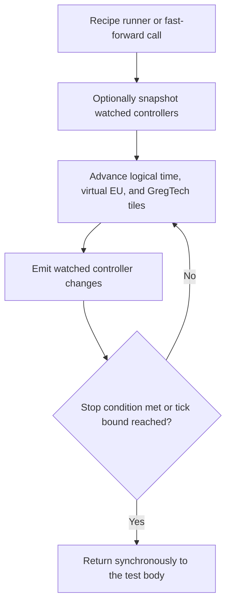

# GTNH multiblock API

`helper.gtnh()` returns `GTNHGameTestHelper`, the GregTech-facing entry point.

| Style | Use it when |
|---|---|
| Fluent `Multiblock` facade | A standard `MTEMultiBlockBase` exposes the controller lists used by the test |
| Imperative `GTNHGameTestHelper` | You need a known position, low-level setup, or a controller the facade does not fully model |

The facade is the safer default for complete recipe scenarios because it keeps world coordinates out of the test body and provides a two-phase recipe runner.

## A complete multiblock scenario

```java
Multiblock ebf = helper.gtnh()
    .multiblock(helper.pos("controller")); // (1)!

ebf.assertFormed();
ebf.fixMaintenance(); // (2)!

ebf.inputBus(0)
    .insert(Materials.Nickel.getDust(1), Materials.Aluminium.getDust(3))
    .programmedCircuit(0);

ebf.energyHatch(0)
    .supply(TierEU.EV, 1, 900); // (3)!

ebf.runRecipe(); // (4)!

ebf.outputs().assertContains(
    ItemMatcher.of(Materials.NickelAluminide.getIngots(4)).count(4)); // (5)!
```

1. The controller label is test-local and rotation-aware.
2. Maintenance flags are real recipe preconditions, so most positive tests fix them before running.
3. The virtual supply job adds `voltage × amperage` EU to this hatch on each simulated warp tick for the requested duration.
4. `runRecipe()` enables the controller, waits until it becomes active, then continues until it returns to idle or reaches its tick bound. It watches the controller for event diffs.
5. Fluent bus assertions ignore `ItemStack.stackSize` unless an `ItemMatcher.count(...)` requirement is supplied.

Hatch and bus indices are positions in GregTech's live typed lists, such as `mInputBusses` and `mEnergyHatches`. They are not template labels. Use labels to find important world positions, and use the facade when the controller's standard lists describe the machine correctly.

## Time-warp

Time-warp force-ticks GregTech tile entities without waiting at 20 TPS.

| API | Behavior |
|---|---|
| `ebf.runRecipe(maxTicks)` | Wait for processing to start, then for the controller to become idle; watches the controller |
| `gtnh.runUntilMachineIdle(controller, maxTicks)` | Stop as soon as the controller is idle, even if no recipe ever started |
| `gtnh.fastForwardTicks(n)` | Simulate exactly `n` ticks without controller recipe diffs |
| `gtnh.fastForwardTicks(n, watchedAbsolutePositions)` | Simulate `n` ticks and diff the listed world-absolute controllers |



`runUntilMachineIdle` is not an imperative equivalent of `runRecipe`. Use it only when the machine is already known to be active or when immediate idle is an acceptable result.

!!! warning "`runRecipe` timeout edge"

    The current implementation fails when a controller never starts, but it does not yet fail when the controller starts and remains active at the tick bound. When that distinction matters, call `ebf.assertNoExplosion()` and assert `!ebf.isProcessing()` after `runRecipe(maxTicks)`.

The default warp region extends 32 blocks in each positive axis from the test origin. Increase it for large structures:

```java
GTNHGameTestHelper gtnh = helper.gtnh().withWarpRange(96);
```

Only `IGregTechTileEntity` instances in that region are force-ticked. Global server time, normal entities, vanilla tile entities, and the outer `GameTestSequence` scheduler do not advance.

For explicit event watching, pass world-absolute controller positions:

```java
gtnh.fastForwardTicks(
    200,
    Collections.singletonList(helper.absolute("controller")));
```

The event recorder clock advances inside the warp, so trace timestamps represent logical test time rather than wall-clock duration. See [Test event log](../reference/events.md).

## Virtual EU supply

```java
ebf.energyHatch(0).supply(TierEU.EV, 1, durationTicks);

// Imperative form for a known test-local hatch position
gtnh.supplyEU(energyHatch, TierEU.EV, 1, durationTicks);
```

Supply jobs advance only during `runRecipe`, `runUntilMachineIdle`, or `fastForwardTicks`. Each simulated tick attempts to add `voltage × amperage` directly to the hatch buffer until the registered duration is exhausted.

This helper controls supply only. It does not simulate cables, packet loss, packet voltage, or hatch-tier rejection. `EUBufferOverflow` is recorded when a job attempts another push after the buffer is already at capacity.

## Maintenance

```java
ebf.fixMaintenance();
gtnh.assertMachineHasIssues(controller, MaintenanceType.WRENCH);
```

`fixMaintenance()` calls GregTech's maintenance repair path and enables the controller. `assertMachineHasIssues(...)` verifies that all named tool issues are currently present.

When maintenance gating itself is under test, do not call `fixMaintenance()`. Supply the other preconditions, advance the machine deliberately, and assert that processing does not begin.

## Buses and hatches

Typed accessors include:

- `inputBus(index)`, `outputBus(index)`, `inputs()`, and `outputs()`
- `energyHatch(index)`
- `inputHatch(index)` and `outputHatch(index)`

For normal insertion behavior:

```java
ebf.inputBus(0).insert(stack);
```

For direct fixture setup that intentionally bypasses insertion rules:

```java
ebf.outputBus(0).setSlot(0, stack);
ebf.outputBus(0).fillAllSlots(stack);
```

For item assertions:

```java
ebf.outputBus(0).assertContains(ItemMatcher.of(stack).count(4));
ebf.outputs().assertNotContains(unexpectedStack);
```

For fluids:

```java
ebf.inputHatch(0).fill(Materials.Nitrogen.getGas(2000));
ebf.outputHatch(0).assertContains(Materials.Oxygen.getGas(1000));
```

## Facade coverage

The facade intentionally follows standard `MTEMultiBlockBase` lists. Use the imperative API for unsupported controller layouts.

- Steam multiblocks do not populate the standard input/output bus lists used by `inputBus`, `outputBus`, `inputs`, and `outputs`.
- ME crafting input buses and ME fluid input hatches are skipped or rejected by normal insert/fill helpers.
- `energyHatch(index)` covers standard `mEnergyHatches`, not TecTech, GT++, or exotic energy lists.
- Mod-specific controllers that store hatches outside standard lists may need labeled positions plus `supplyEU`, `fillHatch`, `gtTile`, or `metaTileEntity`.

## Structure checks

`assertFormed()` runs a forced structure check when needed and fails if the controller remains unformed.

For an invalid template:

```java
Multiblock ebf = helper.gtnh()
    .multiblock(helper.pos("controller"));

ebf.assertNeverForms("EBF formed without coils");
```

`assertNeverForms(...)` performs an immediate forced check, registers a per-test-tick invariant, and succeeds at timeout. If Java code mutates a previously valid fixture, use `assertNotFormed(...)` or `forceStructureCheck()` before trusting `isFormed()`.

## Temporary recipes

`withTestRecipe` adds a recipe to the controller's real recipe map and registers removal through `afterTest`:

```java
GTRecipeBuilder synthetic = GTValues.RA.stdBuilder()
    .itemInputs(Materials.Lead.getDust(1))
    .itemOutputs(Materials.Gold.getIngots(1))
    .duration(200)
    .eut(TierEU.EV);

gtnh.withTestRecipe(ebf, synthetic);
```

The recipe lifetime is scoped to the test, but the underlying recipe map is global. Other concurrently running tests can see it until cleanup. Use unique inputs. In reported execution, keep tests that modify the same map in different batches; run them separately during interactive development.

Injection and removal emit `TestRecipeInjected` and `TestRecipeRemoved`.

## Low-level access and compatibility

The warp differ reads controller snapshots through `GT5UnofficialAdapter`, which contains much of the compatibility-sensitive event logic. The fluent facade and recipe scope also touch GregTech APIs and fields directly, so a GT update can require changes in more than one integration class.

Low-level escape hatches accept test-local positions:

```java
gtnh.gtTile(pos);
gtnh.metaTileEntity(pos);
gtnh.multiBlockController(pos);
```

Prefer the typed facade when it covers the controller, then fall back to these methods for cases that need direct GregTech access.

## Javadoc

Generated API: [`GTNHGameTestHelper`](https://www.gtnewhorizons.com/Horizon-QA/javadoc/com/gtnewhorizons/horizonqa/api/gt/GTNHGameTestHelper.html) and [`Multiblock`](https://www.gtnewhorizons.com/Horizon-QA/javadoc/com/gtnewhorizons/horizonqa/api/gt/Multiblock.html).
