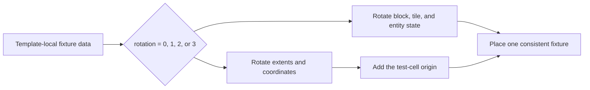

# Structure templates

Structures are compact JSON layouts plus optional structure data for tile entities and entities. They are versioned alongside your mod jar and referenced by name from `@GameTest`.

## On-disk layout

After export or hand-authoring:

```text
src/main/resources/assets/<namespace>/horizonqastructures/
  my_cell.json
  my_cell.snbt   (optional; tile entity and entity data, when text-safe)
  my_cell.nbt    (optional fallback; tile entity and entity data)
```

Runtime resolution is by classpath:

```text
/assets/<namespace>/horizonqastructures/<path>.json
/assets/<namespace>/horizonqastructures/<path>.snbt   (optional)
/assets/<namespace>/horizonqastructures/<path>.nbt    (optional fallback)
```

Reference from tests:

```java
@GameTestHolder("mymod")
public class MyTests {
    @GameTest(template = "multiblock/ebf") // resolves to mymod:multiblock/ebf
    public static void forms(GameTestHelper helper) {
        helper.gtnh().multiblock(helper.pos("controller")).assertFormed();
        helper.succeed();
    }
}
```

## Export workflow

<div class="grid cards horizon-flow" markdown>

-   :material-selection-drag:{ .lg .middle } **Select**

    ---

    Build the fixture, then set both corners with the Horizon Wand.

-   :material-label-outline:{ .lg .middle } **Label**

    ---

    Name controllers, hatches, buses, sensors, and other positions used by Java.

-   :material-export-variant:{ .lg .middle } **Export**

    ---

    Run `/horizonqa export name` to write JSON and optional structure data.

-   :material-package-variant-closed:{ .lg .middle } **Package**

    ---

    Move the files into your mod's `assets/<modid>/horizonqastructures/` directory.

</div>

1. Build the structure in a dev world with Horizon-QA enabled.
2. Select bounds with the **Horizon Wand**: ++left-button++ for pos1, ++right-button++ for pos2.
3. Hold the wand and press ++l++ to label important coordinates such as `controller`, `input_bus`, or `energy_hatch`. Press ++l++ on an existing label to rename it or remove it. Sneak while pressing ++l++ to label the adjacent air block.
4. Run `/horizonqa labels list` and fix any labels outside the selection.
5. Run `/horizonqa export <name>`. Template path segments may use letters, digits, `_`, `-`, and `.` with `/` between segments.
6. The server writes to `<serverDir>/horizonqastructures/`:
   - `<name>.json` with the block palette and layers.
   - `<name>.snbt` with tile entity and non-player entity data, if the generated text round-trips losslessly.
   - `<name>.nbt` instead of `.snbt` when the NBT contains data that Minecraft 1.7.10's SNBT parser cannot represent safely, such as compound keys containing `:`.
7. Move the exported files into your mod's `assets/<modid>/horizonqastructures/`.

To revise an existing template, target the coordinate where the template should start and run `/horizonqa load <modid:path/to/template>`. Horizon-QA places the structure, restores labels onto the wand, and remembers `path/to/template` as the export path. After editing, `/horizonqa export` writes the updated files under `<serverDir>/horizonqastructures/path/to/template.*`.

!!! tip "Label the coordinates the Java code will name"

    If a test will refer to a controller, hatch, bus, button, sensor, or expected output block, put that name in the template. Use `/horizonqa pos` as a temporary debugging aid, not as the usual way to author long-lived test coordinates.

## Format

New exports use `format_version: 2`, a palette keyed by single-character symbols, and a `layers` array in Y-major order. Versions other than 1 and 2 are rejected; a missing version is treated as version 1 for backward compatibility. The loader throws `IOException` with explicit messages for missing layers and unknown palette keys; on a load failure the server log identifies the file and the offending key.

The optional structure data file uses `tiles` as a list of tile entity compounds and `entities` as a list of non-player entity compounds; both are merged at placement time. New exports prefer text `<path>.snbt`, but only write it after parsing the generated text back and confirming the NBT tree is unchanged. If that round-trip is not lossless, the exporter writes combined binary `<path>.nbt`. The loader order remains `<path>.snbt`, then combined `<path>.nbt`, then the legacy `<path>_tiles.nbt` and `<path>_entities.nbt` sidecars.

### Portable ItemStack data

Format version 2 stores the identity of each standard ItemStack compound as its registry name instead of the numeric item ID assigned by the exporting modpack. For example:

```snbt
{
  HorizonQAItemId: "minecraft:spawn_egg",
  Count: 1b,
  Damage: 93s
}
```

`HorizonQAItemId` is an explicit portable identity field, so unrelated mod compounds that happen to contain fields named `id`, `Count`, and `Damage` are not mistaken for ItemStacks while loading. Export applies this conversion recursively through tile entity and entity NBT, including inventories, dropped items, equipment, and ItemStacks nested inside other ItemStack data. Loading resolves each name against the active item registry once and stores the runtime representation before placement. A missing registry name fails the template with an error that includes the name and its NBT path; the structure is not partially placed.

Only recognized ItemStack compounds are converted. Arbitrary numeric fields such as enchantment IDs, potion IDs, and mod-private values are preserved. Registry names also cannot compensate for an item that was removed or renamed, or for a mod that changed the meaning of an item's metadata or private NBT.

Format version 1 templates that contain numeric ItemStack IDs are rejected because those IDs may identify different items in another modpack. To migrate one, launch the original environment with `-Dhorizonqa.allowLegacyNumericItemIds=true`, load the template with interactive `/horizonqa load`, and export it again. The opt-in trusts the current numeric registry only for that command and has no effect on CI or any test execution path. With Gradle server runs, pass it through `--mcJvmArgs`.

## Coordinate labels

Templates may include optional coordinate labels:

```json
{
  "format_version": 2,
  "size": [1, 1, 1],
  "palette": {
    "A": {"name": "minecraft:stone", "meta": 0, "label": "Stone"}
  },
  "layers": [
    [
      "A"
    ]
  ],
  "annotations": {
    "labels": {
      "stone": [0, 0, 0]
    }
  }
}
```

Labels are optional for loading and running tests, but any labels present in a template are validated. Names must match `[A-Za-z_][A-Za-z0-9_]*`; prefer `snake_case`. Coordinates are template-relative `[x, y, z]` and must be inside `size`.

Use labels from Java:

```java
helper.assertBlockPresent(Blocks.stone, "stone");
TestPos controller = helper.pos("controller");
TestPos controllerWorld = helper.absolute("controller");
```

Coordinate-based helpers accept raw test-local coordinates, a test-local `TestPos`, or a structure label directly. `helper.pos("name")` remains useful when a position must be stored or passed to another API. It returns test-relative coordinates with `@GameTest(rotation = ...)` applied; `helper.absolute("name")` returns world coordinates after the same rotation. Asking for an undefined label fails the test as an infrastructure error with type `LABEL_ERROR`.

## Placement in the grid

The reported batch runner places each test's template into a dedicated grid cell with margin for clearance. CI defaults to Horizon-QA's void world, but `-Dhorizonqa.world=normal` leaves the server's configured or existing world type in place, and `-Dhorizonqa.gridOrigin=x,y,z` moves the grid start. Successful reported placement emits `StructurePlaced` in the [event log](../reference/events.md). A missing or invalid template becomes a reported infrastructure error.

The normal interactive runner also allocates a dedicated cell. A template load failure prevents the affected test from starting and leaves a pink `TEMPLATE_ERROR` marker with the specific failure message; the server log contains the complete error.

## Rotation

Set `rotation` on `@GameTest` (values `0-3`) to validate that labels, facings, and GregTech hatch lists still behave after 90° steps. Blocks, tile entities, exported entities, and labels are rotated together. If a test only passes at `rotation = 0`, check for raw coordinates or facing assumptions before documenting the limitation.



## Empty templates

Omit `template` (or use `template = ""`) for tests that only need void space: block-placement smoke tests, helper API checks, and the like.

## Choosing between `setBlock` and an exported template

Every test falls into one of two categories, and the right template strategy follows from which one you are writing.

### Logic tests: empty template + `setBlock`

A **logic test** verifies behavior that does not depend on a specific world layout. The test builds exactly the state it needs via `setBlock`, runs the logic under test, and asserts the outcome. No template file exists on disk.

```java
@GameTest(timeoutTicks = 20)
public static void chestInsertAndAssert(GameTestHelper helper) {
    helper.setBlock(0, 0, 0, Blocks.chest);
    helper.startSequence()
        .thenIdle(1)
        .thenExecute(() -> {
            helper.insertItem(0, 0, 0, new ItemStack(Items.diamond, 5));
            helper.assertInventoryContains(0, 0, 0, new ItemStack(Items.diamond, 5));
        })
        .thenSucceed();
}
```

The test owns every block it places. When the system under test changes, the test changes with it; there is no template to re-export.

Typical subjects:

- Helper API correctness (`setBlock`, `destroyBlock`, `assertBlockPresent`).
- Single-block tile-entity interactions (chest insertion, furnace smelting).
- Redstone or signal propagation with a handful of blocks.
- Any scenario where the interesting part is the *sequence of actions*, not the structure they act on.

### Structure tests: exported template

A **structure test** validates behavior that emerges from a pre-built world layout: formed multiblocks, multi-tile wiring, spatial relationships between hatches. The template is exported once with `/horizonqa export` and loaded at test time.

```java
@GameTest(template = "ebf", timeoutTicks = 1500, batch = "gtnh")
public static void testTitaniumSmelting(GameTestHelper helper) {
    Multiblock ebf = helper.gtnh().multiblock(helper.pos("controller"));
    ebf.assertFormed();
    ebf.fixMaintenance();
    ebf.inputBus(0)
        .insert(Materials.Nickel.getDust(1), Materials.Aluminium.getDust(3))
        .programmedCircuit(0);
    ebf.energyHatch(0).supply(TierEU.EV, 1, 900);
    ebf.runRecipe();
    ebf.outputs().assertContains(
        ItemMatcher.of(Materials.NickelAluminide.getIngots(4)).count(4));
    helper.succeed();
}
```

The test assumes the structure is already correct and focuses on what happens *inside* it. Rebuilding an EBF block-by-block with `setBlock` would duplicate the template's information, couple the test to layout coordinates, and break whenever a block id or metadata changes.

Typical subjects:

- Multiblock formation and recipe processing.
- Hatch roles, maintenance, and energy supply across a formed machine.
- Negative-formation tests (e.g. `ebf_no_coils`) that assert a machine *does not* form.
- Any scenario where the interesting part is the *structure itself* or how a machine behaves within it.

### Decision guide

| Signal                                       | Strategy              |
|----------------------------------------------|-----------------------|
| Fewer than ~5 blocks, simple arrangement     | `setBlock`            |
| Testing API helpers, not world state         | `setBlock`            |
| Multiblock or complex tile-entity wiring     | Exported template     |
| Layout accuracy is *part of* the assertion   | Exported template     |
| Rotation coverage is required                | Exported template     |

When in doubt, ask: *"If the layout changed tomorrow, should this test break?"* If yes, the layout is load-bearing: export a template so the test guards it. If no, build the state inline so the test stays decoupled.

## Examples in this repo

| Template                                      | Purpose                            |
|-----------------------------------------------|------------------------------------|
| `horizonqaexamples:single_stone`              | Single block                       |
| `horizonqaexamples:stone_platform`            | Small platform                     |
| `horizonqaexamples:ebf`                       | Formed EBF with hatches            |
| `horizonqaexamples:ebf_no_coils`              | Intentionally invalid EBF          |
| `horizonqaexamples:distillation_tower_4`      | Multi-output hatch routing         |
| `horizonqaexamples:cleanroom`                 | Cleanroom efficiency over time     |

Source: `examples/src/main/resources/assets/horizonqaexamples/horizonqastructures/`.
