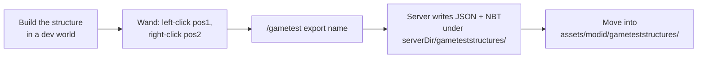

# Structure templates

Structures are compact JSON layouts plus optional NBT for tile entities. They are versioned alongside your mod jar and referenced by name from `@GameTest`.

## On-disk layout

After export or hand-authoring:

```text
src/main/resources/assets/<namespace>/gameteststructures/
  my_cell.json
  my_cell_tiles.nbt    (optional; tile entity data)
```

Runtime resolution is by classpath:

```text
/assets/<namespace>/gameteststructures/<path>.json
```

Reference from tests:

```java
@GameTestHolder("mymod")
public class MyTests {
    @GameTest(template = "multiblock/ebf") // resolves to mymod:multiblock/ebf
}
```

## Export workflow



1. Build the structure in a dev world with Horizon-QA enabled.
2. Select bounds with the **Horizon Wand** — ++left-button++ for pos1, ++right-button++ for pos2.
3. Run `/gametest export <name>`. Allowed characters: letters, digits, `_`, `-`.
4. The server writes to `<serverDir>/gameteststructures/`:
   - `<name>.json` — block palette and layers.
   - `<name>_tiles.nbt` — tile entities, if any.
5. Move both files into your mod's `assets/<modid>/gameteststructures/`.

!!! tip "Use `/gametest pos` while authoring"

    Stand inside the structure and run `/gametest pos`. The output gives you click-to-copy `helper.absolute(x, y, z)` snippets for controllers and hatch roles — much faster than translating world coordinates by hand.

## Format

Templates use `format_version: 1`, a palette keyed by single-character symbols, and a `layers` array in Y-major order. The loader throws `IOException` with explicit messages for missing layers and unknown palette keys; on a load failure the server log identifies the file and the offending key. Tile entity data is stored separately in `_tiles.nbt` and merged at placement time.

## Placement in the grid

The batch runner places each test's template into a dedicated cell on the void world grid with margin for clearance. Structure placement emits `StructurePlaced` in the [event log](../reference/events.md), so a missing structure surfaces in CI without a manual rerun.

## Rotation

Set `rotation` on `@GameTest` (values `0–3`) to validate that role indices and `Multiblock` wiring still match after 90° steps. If a test only passes at `rotation = 0`, document why in a short comment — that asymmetry almost always points at a coordinate that should have been a role lookup.

## Empty templates

Omit `template` (or use `template = ""`) for tests that only need void space: block-placement smoke tests, helper API checks, and the like.

## Examples in this repo

| Template                                | Purpose                       |
|-----------------------------------------|-------------------------------|
| `gametestexamples:single_stone`         | Single block                  |
| `gametestexamples:stone_platform`       | Small platform                |
| `gametestexamples:ebf`                  | Formed EBF with hatches       |
| `gametestexamples:ebf_no_coils`         | Intentionally invalid EBF     |

Source: `examples/src/main/resources/assets/gametestexamples/gameteststructures/`.
