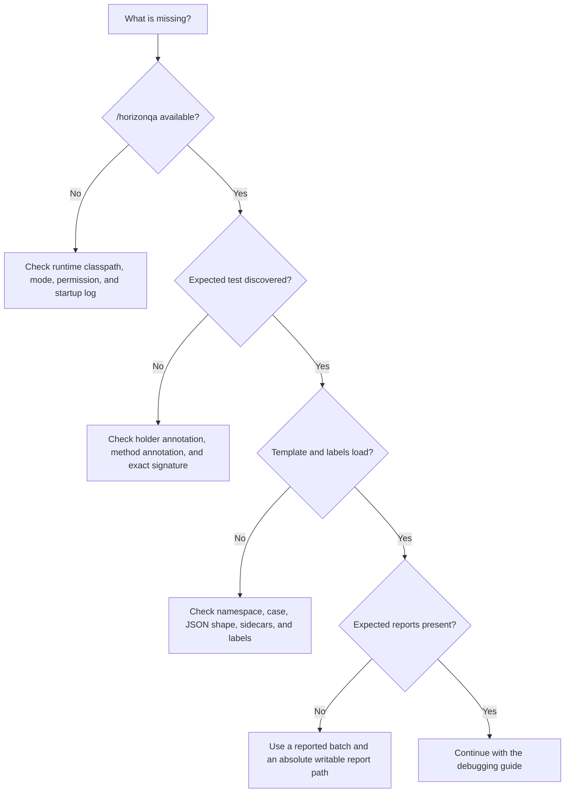

# Setup troubleshooting

Use this page when Horizon-QA is not reaching the point where a normal test failure can be debugged. For a test that ran and failed, use [Debugging failed tests](debugging.md).



## `/horizonqa` is not available

Check:

1. Horizon-QA is present on the server runtime classpath, not only the compile classpath.
2. `horizonqa.mode` is unset or set to `interactive` or `ci`.
3. The command sender has permission level 2.
4. The server log contains the Horizon-QA version and resolved runtime behavior.

`-Dhorizonqa.mode=off` intentionally leaves commands and discovery inactive.

## The property appears to be ignored

Pass properties to the Minecraft server JVM through RetroFuturaGradle:

```bash
./gradlew runServer --mcJvmArgs="-Dhorizonqa.mode=ci"
```

This does not work:

```bash
./gradlew -Dhorizonqa.mode=ci runServer
```

The second form configures the Gradle daemon, not Minecraft.

## No tests are discovered

Confirm that:

- the holder class is on the server runtime classpath,
- the class has `@GameTestHolder("mymod")`,
- the method has `@GameTest`,
- the method is exactly `public static void name(GameTestHelper helper)`,
- `timeoutTicks` is positive and `rotation` is between `0` and `3`,
- the holder namespace and batch names follow the validation rules.

Discovery logs every invalid definition with its reason. See [Annotations](../reference/annotations.md) for the accepted values.

## A selector matches no tests

`horizonqa.tests` accepts only namespace selectors and exact test IDs:

```text
-Dhorizonqa.tests=mymod
-Dhorizonqa.tests=mymod:SmokeTests.emptyCellPasses
```

Wildcards are not supported. A valid selector that matches nothing is an infrastructure issue in automatic CI. Use `horizonqa.allowNoTests=true` only when an empty selection is expected.

## A template cannot be loaded

For `@GameTestHolder("mymod")` and `@GameTest(template = "machines/ebf")`, verify this classpath resource:

```text
assets/mymod/horizonqastructures/machines/ebf.json
```

Also check:

- the JSON path and letter case,
- `format_version`, `size`, palette symbols, and layer dimensions,
- the optional `.snbt` or `.nbt` file beside the JSON; lookup order is `.snbt`, combined `.nbt`, then legacy `_tiles.nbt` and `_entities.nbt` sidecars,
- whether a fully qualified reference uses `othermod:path` correctly.

A template load failure prevents the affected test from starting. Reported execution records a `TEMPLATE_ERROR`; an interactive run shows the same kind and message on its pink error marker. Inspect the server log for the complete error before debugging the test body.

Use [Structure templates](structures.md) for the export and packaging layout.

## A template reports a numeric or missing ItemStack ID

Version 2 structure data stores ItemStack registry names recursively. If a named item is not registered in the current environment, template placement fails with the missing name and its NBT path. Install the owning mod or re-export after intentionally replacing the item; changing numeric registry assignments will not fix a missing name.

A version 1 template with numeric ItemStack IDs is unsafe outside the environment that exported it and is rejected during test execution. To migrate it, start that original environment with the temporary opt-in, use interactive `/horizonqa load`, and export it again:

```bash
./gradlew runServer \
  --mcJvmArgs="-Dhorizonqa.allowLegacyNumericItemIds=true"
```

The property trusts the current numeric mapping only for interactive `/horizonqa load`; it never relaxes CI, reported-batch, or interactive-test loading. Remove it after producing the version 2 template. Numeric fields that are not ItemStack identities, such as enchantment IDs or mod-private values, are deliberately left unchanged.

## A label is missing

`helper.pos("controller")` requires an `annotations.labels.controller` entry in the loaded template.

Reload the fixture with `/horizonqa load`, restore or rename the label with the Horizon Wand, export again, and move the updated JSON back into the mod resources. A missing label is an infrastructure error because the Java test and fixture disagree.

## Reports are missing

Reports are written only by automatic or manually reported batches.

- For startup execution, use `-Dhorizonqa.mode=ci`.
- For a command-started reported batch, add `-Dhorizonqa.autoRun=false`, then use `run`, `runall`, or `runfailed`.
- Interactive mode does not write reports for normal cell runs.

Relative report paths resolve from the server working directory, normally `run/server` in a GTNH Gradle project. Prefer an absolute path:

```bash
./gradlew runServer \
  --mcJvmArgs="-Dhorizonqa.mode=ci -Dhorizonqa.reportDir=${PWD}/build/horizonqa"
```

The server performs a report-path preflight before execution. Read the console for permissions, directory collisions, or unwritable targets.

## A command says another batch is active

Only one automatic or manually reported batch runner may be active. While it is running, interactive launch, relaunch, and clear commands are rejected. Wait for that reported run to finish.

If this appears after an abnormal server lifecycle, restart the development server so the runner state is rebuilt cleanly.

## A fluent hatch or bus accessor fails

`Multiblock` reads standard live `MTEMultiBlockBase` lists. An out-of-range or unsupported accessor can mean:

- the structure is not formed and its hatch lists were not populated,
- the template changed the order or number of hatches,
- the controller uses steam, ME, TecTech, GT++, or another non-standard list,
- the requested tile is a debug or virtual ME hatch that normal insertion cannot drive.

First call `assertFormed()` and inspect the controller topology in the event trace. If the controller layout is outside facade coverage, use a labeled position with the imperative `GTNHGameTestHelper` API. See [Facade coverage](gtnh-api.md#facade-coverage).

## Overlays are not visible

Visual overlays require:

- interactive mode,
- a connected development client with Horizon-QA loaded,
- a test cell created by an interactive run.

A dedicated server process alone can run tests and log results, but it cannot display client rendering.
