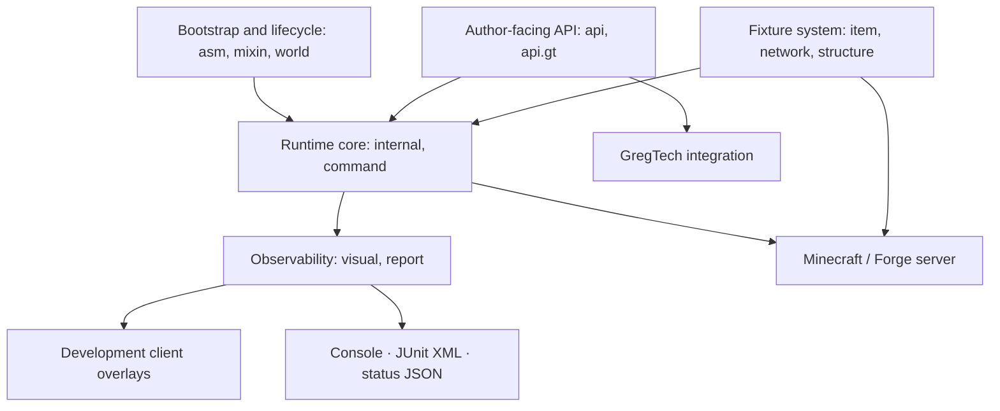

# Package layout

Convention for **consumer mods** adding GameTests. This page is not about classes inside the Horizon-QA jar itself; for that, see [Framework internals](#framework-internals-contributors) below.

## Test code

Mirror the **system under test**, not the implementing Java class:

```text
src/main/java/<base>/tests/
  multiblock/<machine-name>/     ← single-mod multiblock tests
  compatibility/<modA>_<modB>/   ← cross-mod scenarios
```

!!! warning "Avoid a flat `tests/` package"

    A flat dump does not scale once a modpack has 50 tests across 10 mods. Group by what is being verified (a machine, a compatibility surface) so a reviewer can find the relevant tests without grepping.

The `examples/` directory in **this repository** is reserved for framework demonstrations. Do not copy that name into a production mod as a generic catch-all bucket.

## Structure assets

```text
src/main/resources/assets/<modid>/horizonqastructures/
  <path>.json
  <path>.snbt   (optional; text structure data)
  <path>.nbt    (optional fallback; binary structure data)
```

Template reference: `@GameTest(template = "path")` with `@GameTestHolder("<modid>")` resolves to `<modid>:path`.

## Test ids and CI

Test ids appear in:

- `/horizonqa run <id>`
- `TEST-horizonqa.xml`
- Console batch summaries

Keep the holder `value` equal to your mod id unless you have a strong reason to namespace tests separately; diverging makes results harder to trace back from CI.

## Framework internals (contributors)

| Package      | Role                                                               |
|--------------|--------------------------------------------------------------------|
| `api`        | Public test-author API, annotations, positions, and typed events   |
| `api.gt`     | GregTech helpers, time-warp, typed hatches, buses, and `Multiblock` |
| `asm`        | Forge loading plugin and annotation-discovery bootstrap            |
| `command`    | `/horizonqa` command handling                                      |
| `internal`   | Registry, selection, grid, test instances, sequences, and runners  |
| `item`       | Horizon Wand state and interaction                                 |
| `network`    | Client/server messages used by wand labels                         |
| `report`     | Console, JUnit XML, status JSON, and atomic report writing          |
| `structure`  | Template loading, placement, rotation, and export                   |
| `visual`     | Client overlays, beacons, labels, and ghost-block differences      |
| `world`      | Dedicated void world type and chunk provider                       |
| `mixin`      | Server lifecycle, shutdown, networking, and world hooks            |

See [Contributing](../contributing/index.md) for design constraints on changes to these packages.



This component view intentionally groups responsibilities instead of presenting a class-by-class UML diagram.
